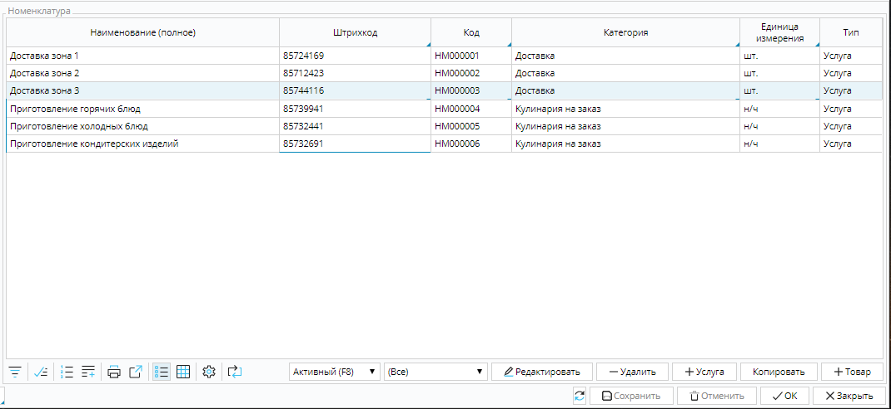
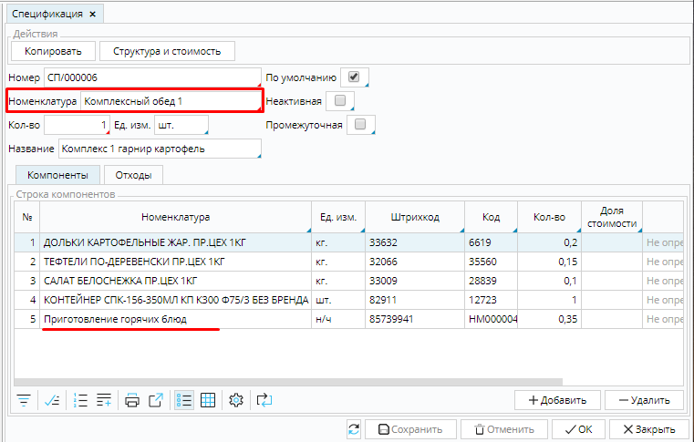
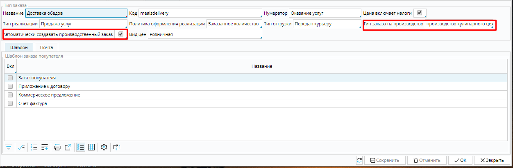
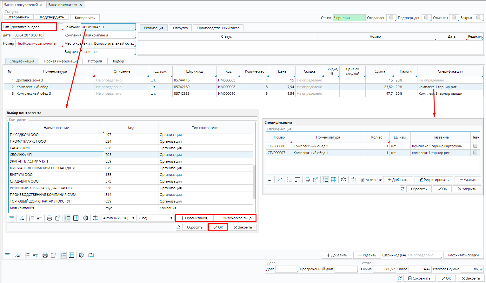
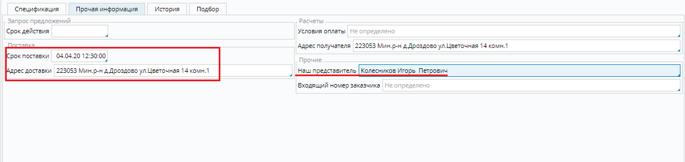
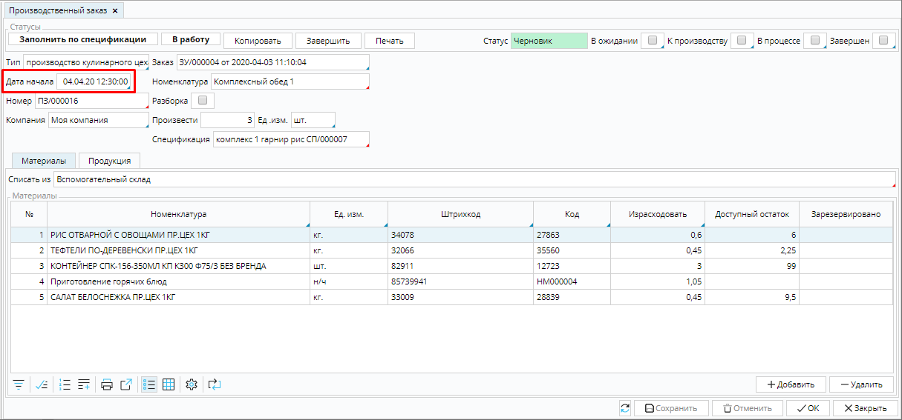
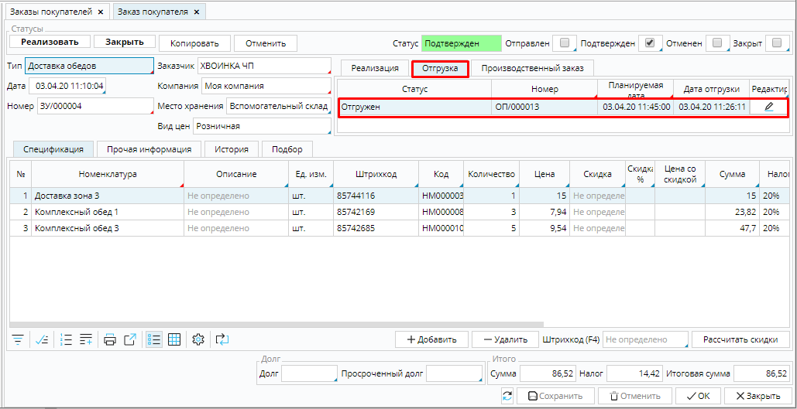
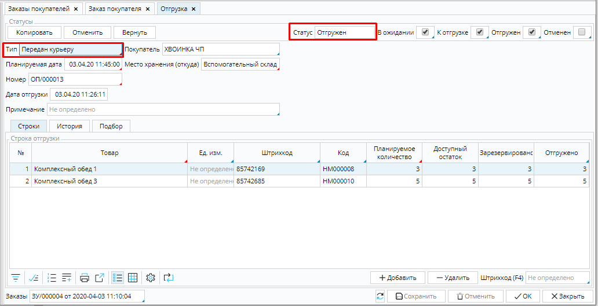
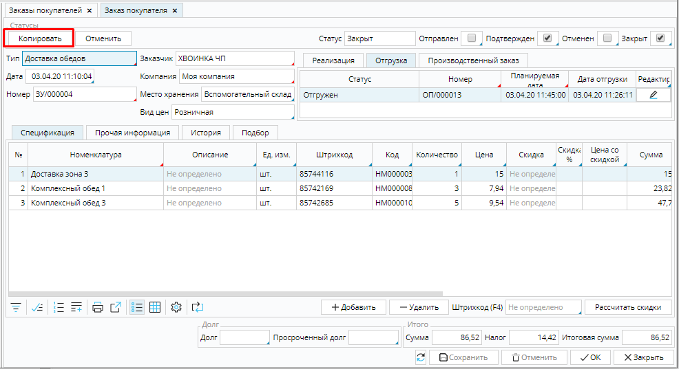

Широкий спектр услуг требует предварительной подготовки и планирования, например, предварительное обследование местности, определение и закупка материалов для бурения скважин, планирование времени для выезда при сборке мебели, и т.д.

В таком случае для управления процессом оказания услуг необходимо использовать функциональность **[Заказа покупателя](Customer_orders.md)**. 

Рассмотрим, как организовать управление оказанием подобных  услуг в MyCompany, на примере доставки обедов в офисы. 

Чтобы оказать эту услугу, необходимо:

-   зафиксировать предварительные заказы от покупателей,
-   дать задание поварам приготовить заказанные блюда в необходимом количестве к определенному времени,
-   скомплектовать заказы и доставить еду по указанному заказчиком адресу.   

Стоимость услуги будет складываться из стоимости заказанных блюд, работы поваров и курьеров. 

Для начала необходимо создать соответствующую [**номенклатуру**](Items_directory.md).

Для учета стоимости работ созданы **Услуги** по доставке в разные зоны и приготовлению типов блюд.

### Рис. 1 Перечень задействованных работ

Блюда в меню - это **Товары**, которые собираются по [**спецификации**](Bills_of_Materials.md), кроме ингредиентов включающей еще и стоимость работ по приготовлению блюд.

### Рис. 2 Спецификация блюда меню

  

Необходимо настроить [**тип заказа на продажу**](Customer_order_types.md), который будет использоваться для оказания услуги.  Для доставки обедов важно, чтобы заказанные блюда были приготовлены вовремя, поэтому обязательно надо включить функцию автоматического создания производственного заказа. 

### Рис. 3 Настройка типа заказа

  

Для регистрации заказа от клиента в модуле **Продажи** необходимо создать новый [**заказ покупателя**](Customer_orders.md), выбрать **Тип** заказа, указать клиента в поле **Заказчик**, выбрав его из списка, если он уже обращался, или создать карточку нового клиента и ввести данные, используя кнопки **+Организация** или **+Физическое лицо** в окне выбора **[контрагента](Partners_directory.md)**, указать заказанные блюда из меню и их количество, добавить в заказ услугу *Доставка*, соответствующую зоне адреса доставки. На вкладке **Прочая информация** проверьте правильно ли указан адрес, укажите дату и время доставки, в поле **Наш представитель**  при необходимости можно указать менеджера, который отвечает за работу с заказами, или курьера, который будет доставлять заказ.

### Рис. 3,4 Оформление заказа

  

Когда заказ принят, надо нажать кнопку **Подтвердить**, и будут сформированы [**производственные заказы**](Auto_created_manufacturing_order_from_customer_order.md) поварам. Чтобы все блюда были приготовлены вовремя, необходимо перейти в модуль **Производство**, и открыть сформированные заказы. По умолчанию, в поле **Дата начала** будет указана дата и  время доставки. В зависимости от длительности приготовления блюд, необходимо изменить эти данные так, чтобы заказ был готов к моменту, когда курьер будет его забирать для доставки.

### Рис. 5 Дата начала производственного заказа.

  

Когда заказ готов к доставке, его передают курьеру и оформляют [**отгрузку**](Shipments.md).  

Рис. 6, 7 Готовый заказ передан курьеру для доставки

  

Когда заказ доставлен и оплачен, оформляют [**реализацию**](Customer_invoice_and_Payment_collection.md) и закрывают заказ. Для оформления заказов постоянных клиентов удобно использовать функцию **Копирования** заказа, которая позволяет создать уже заполненный заказ, в который останется только внести изменения. 

### Рис. 8 Функция копировать заказ

  

Это всего лишь один пример автоматизации оказания услуг с MyCompany. Используя разнообразие настроек модулей вы сможете создать базу практически для любой своей услуги.

  

  

