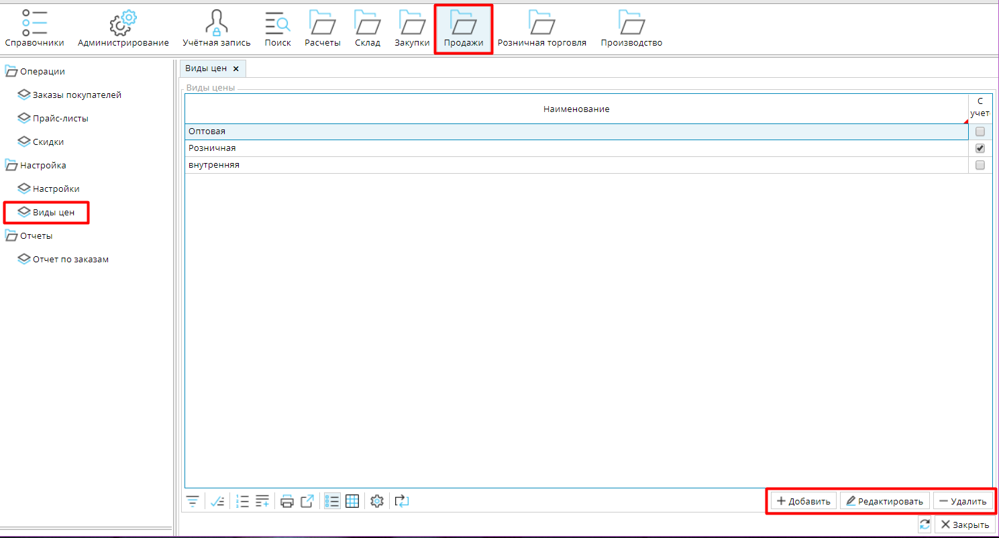
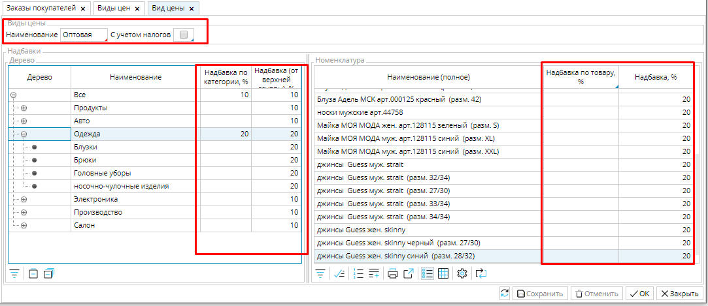

Настройте все виды цен, которые вы используете при продаже своих товаров. Наиболее часто используемые - это оптовые и розничные цены, но могут быть, конечно, и иные, которые, например, применяются для расчетов между вашими компаниями, и т.д.

Виды цен настраиваются в **Продажи - Виды цен**. Кликните **Добавить** и выполните необходимые настройки.

### Рис. 1 Список видов цен

  

### Рис. 2 Настройка вида цен

  

Выберите "говорящее" **Наименование**, чтобы легко ориентироваться в видах цен. 

Если налог должен быть включен в состав цены, включите опцию **С учетом налогов**.

В левом блоке надбавок **Дерево**, укажите надбавку к себестоимости  для категорий товаров, которая сформирует настраиваемую цену. В правом блоке **Номенклатура** вы можете установить надбавку для отдельных товаров, если она отличается от надбавки для категории.

Сохраните настроенный вид цен.

  

  
