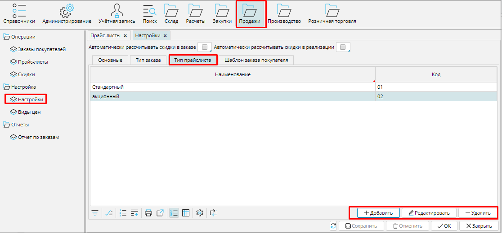
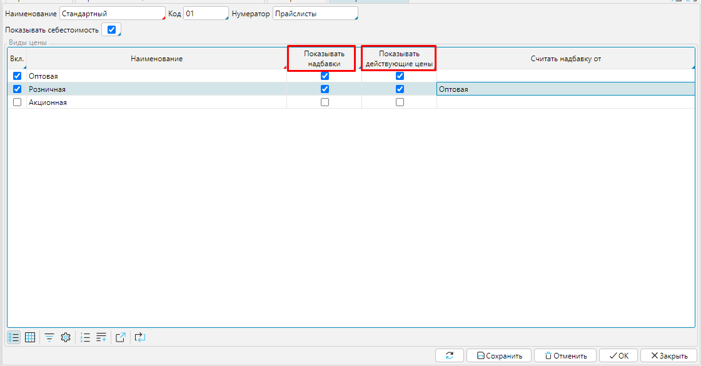

Типы прайс-листов можно настроить в **Продажи** - **Настройки** - **Тип прайс листа**. Чтобы управлять списком типов прайс-листов используют кнопки в правом нижнем углу. 

### Рис. 1 Список типов прайс-листов

  

Чтобы создать новый тип, надо нажать кнопку **Добавить** и в открывшейся форме указать его свойства.

Введите **Наименование** и **Код** типа прайса, чтобы его было легко идентифицировать. Установите [**Нумератор**](Numerators.md).

**Показывать себестоимость** - отметьте галочкой, чтобы в прайсе отображалась себестоимость включенных в него товаров. 

В блоке ***[Виды цен](Price_type_settings.md)***:

Вкл. - отметьте, какие цены будут отображены в прайсе. 

Показывать надбавки и Показывать действующие цены - отметьте галочками что будет отображено  для каких видов цен. 

Считать надбавку от - вы можете выбрать вид цен, от которого в прайсе будет рассчитана надбавка для каждого вида цен. 

**Сохраните** настройки

### Рис. 2 Тип прайс-листа

  

  

  

