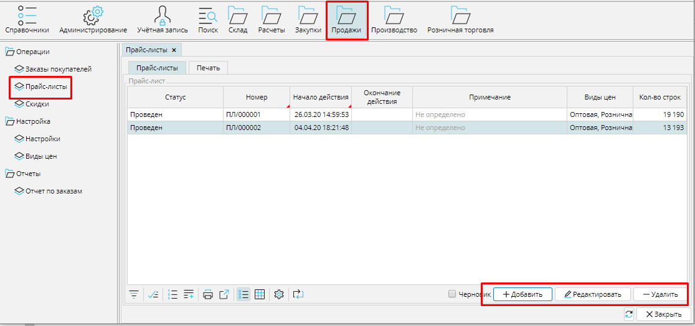
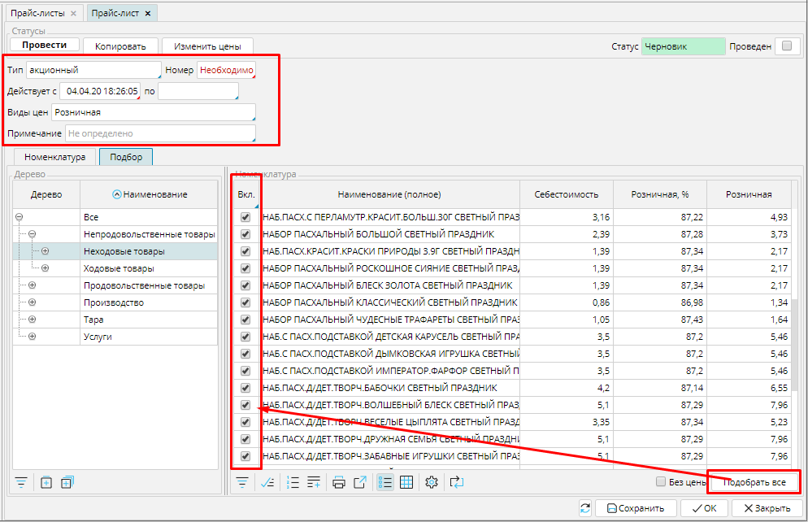
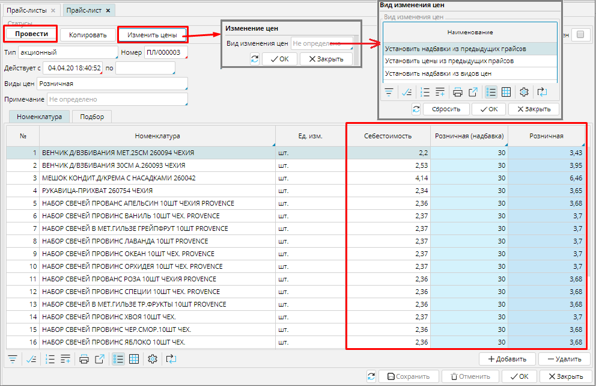
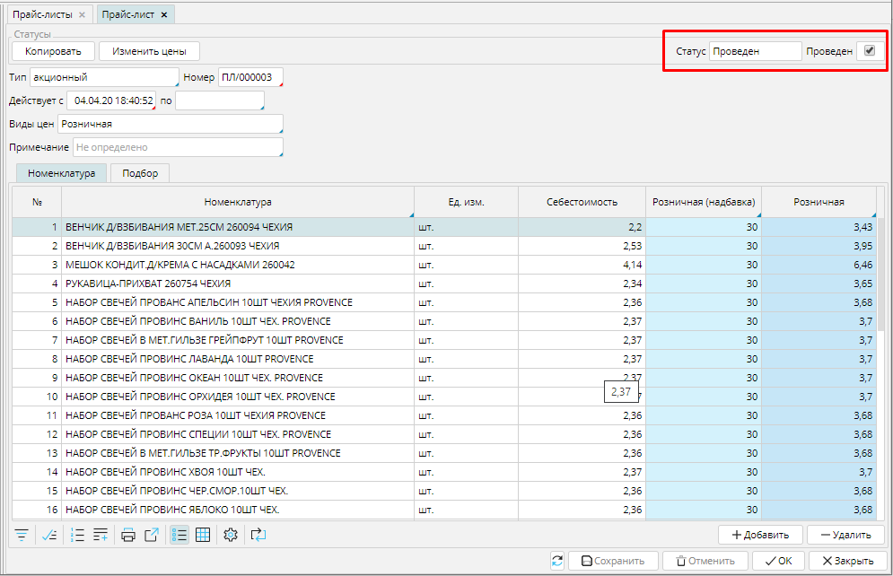

Использование прайс-листов существенно экономит ваше время при осуществлении продаж. С помощью прайс-листов вы можете настроить все возможные цены на все ваши товары. 

Список прайс-листов вы найдете в **Продажи - Прайс-листы**.

#### Рис. 1 Список прайс-листов

  

Кликните **Добавить**, чтобы создать новый прайс-лист и заполните необходимые поля.

**Тип** - выбери **[тип прайс-листа](Pricelist_types.md)** из списка настроенных. 

### Номер** - укажите вручную или настройте [**нумератор**](Numerators.md). Нумератор прайс-листов для продажи назначается на вкладке **Продажи** - **Настройки** - **Тип прайс-листа

**Действует с \_\_\_ по** - укажите срок действия прайс-листа.

**Вид цен** - здесь указаны виды цен, которые отображаются в прайс-листе в соответствии с типом прайса. При необходимости вы можете их изменить, кликните в поле и выберите необходимые виды цен.

**Примечание** - напечатайте важную информацию, которая поможет вам идентифицировать данный прайс-лист в списке.

Добавлять товары в прайс-лист можно по одному, используя кнопку **Добавить** на вкладке **Номенклатура **(см. рис. 3). Однако, в прайс-листе редко бывает малое количество товаров, поэтому удобнее использовать вкладку **Подбор**. В правом блоке отображаются товары категории, выбранной в левом блоке. Отметьте в столбце **Вкл**. те товары, которые необходимо добавить в прайс-лист (см. рис. 2). Если надо отметить все товары в категории, используйте кнопку  Подобрать все. На вкладке **Подбор** будут отображены действующие цены и надбавки.

Если вам необходимо изменить цены на товары из другого прайс листа, можно использовать кнопку **Копировать**. 

#### Рис. 2 Заполнение нового прайс-листа

  

На вкладке **Номенклатура** будут отображаться данные в соответствии с настройками [**типа прайс-листа**](Pricelist_types.md), автоматически будут рассчитаны виды цен, указанные в шапке прайс-листа, на основании установленных для них надбавок, однако вы можете вручную их скорректировать,  при этом надбавки для этого прайс-листа будут пересчитаны.

Для быстрой корректировки цен можно использовать кнопку **Изменить цены**, и выбрать один из трех вариантов: **Установить надбавки из видов цен**, Установить надбавки из предыдущих прайсов или Установить цены из предыдущих прайсов.

#### Рис. 3 Установка цен в прайс-листе

  

Чтобы цены из прайс-листа стали действующими, т.е. применялись в документах на продажу, прайс нужно **Провести** и статус изменится на ***Проведен***. 

#### Рис. 4 Прайс-лист в статусе Проведен

  

  
