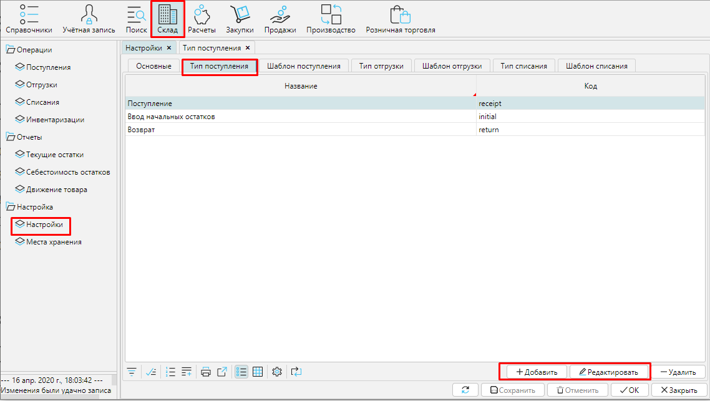
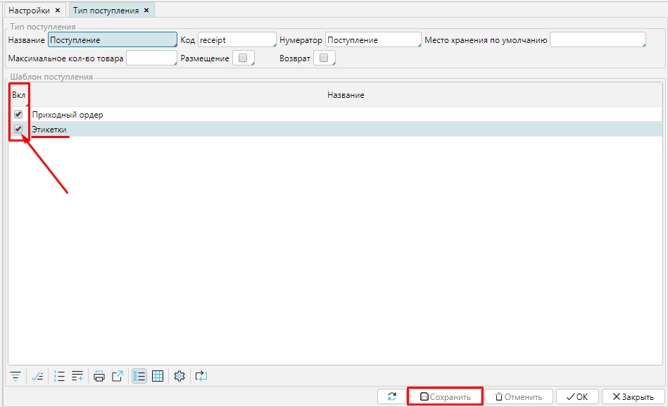
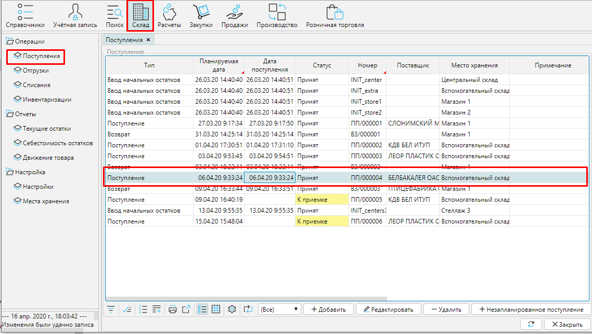
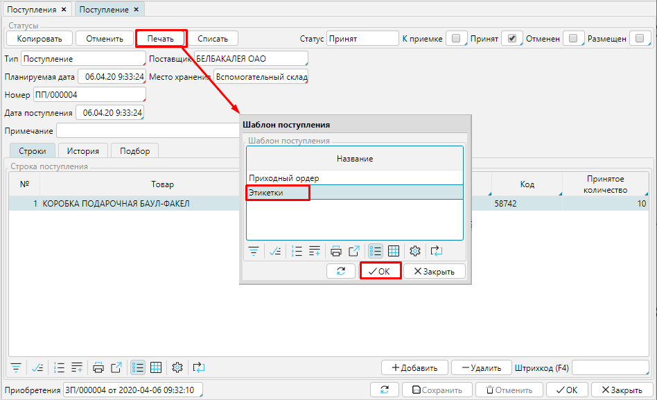
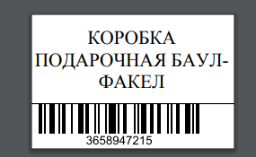

Этикетки-ценники  для каждой единицы  товара можно распечатать из документа [**поступления**](Receipts.md). Для этого необходимо настроить **[тип поступления](Receipt_type.md)**, для которого будет доступна печать этикеток. 

В модуле **Склад** - **Настройки** на вкладке **Тип поступления** выберите и откройте с помощью кнопки **Редактировать** или двойным щелчком мыши тип поступления, для которого необходимо настроить печать этикеток, или используйте кнопку **Добавить** и создайте новый тип.

### Рис. 1 Список типов поступлений

  

На форме типа поступления активируйте шаблон ***Этикетка*** отметив для него галочку **Вкл**. **Сохраните** тип поступления. 

### Рис. 2 Включение печати этикетки для типа поступления

  

В Склад - Поступления выберите и откройте документ, для товаров из которого необходимо напечатать этикетки.

### Рис. 3 Выбор поступления для печати этикеток

  

В Поступлении нажмите кнопку **Печать**, выберите ***Этикетки*** из списка доступных для печати документов и нажмите **ОК**.

### Рис. 4 Формирование файла с этикетками для печати

  

Будет сформирован и открыт документ PDF содержащий этикетки для каждого наименования товаров в Поступлении в количестве принятых единиц. 

### Рис. 5 Пример  этикетки

  

  

  

