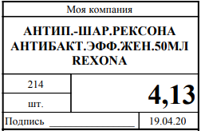
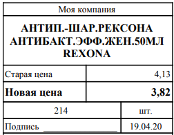
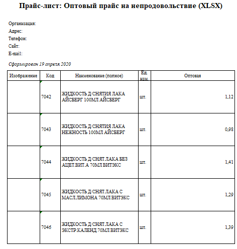
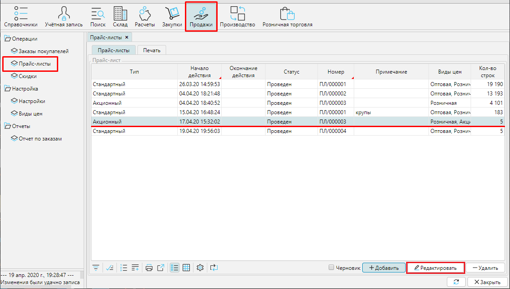
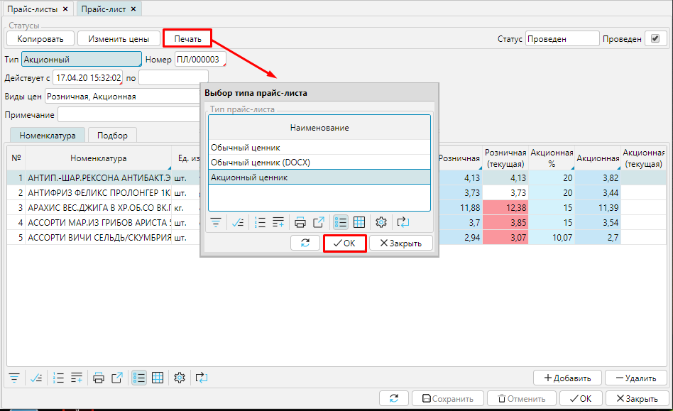
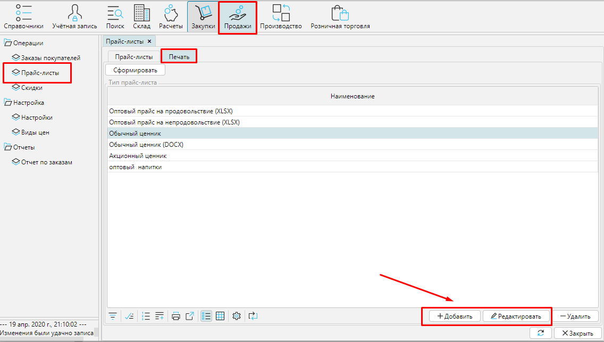
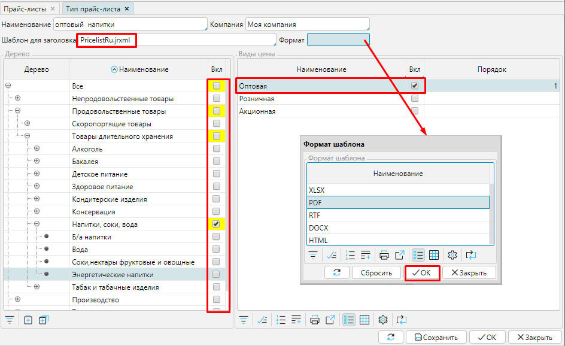
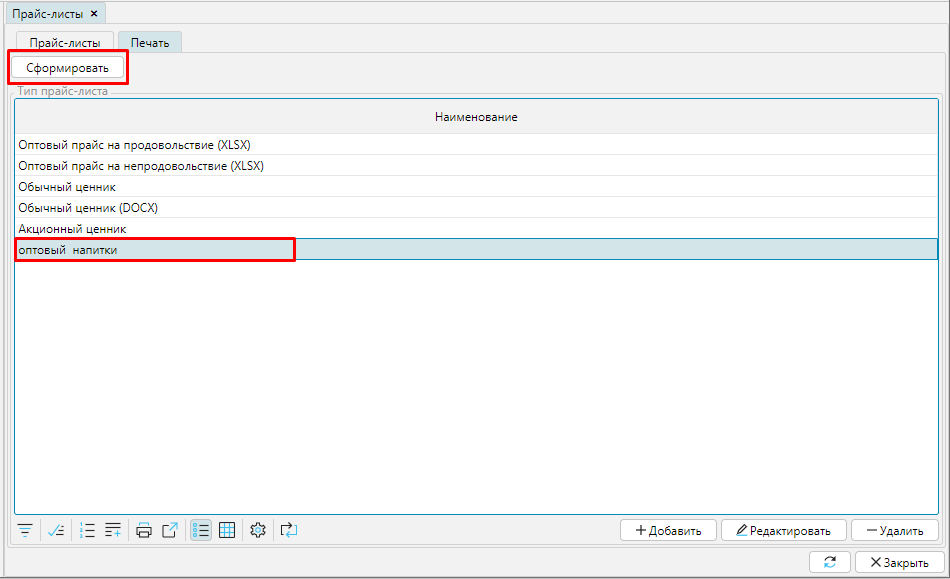

Чтобы указать цену на товары, которые вы продаете, достаточно распечатать ценники на основании действующих [прайс-листов](Pricelists.md).

В MyCompany предустановлены следующие шаблоны:

### **Обычный ценник**

  

### **Акционный ценник**

  

### **Прайс-лист**

### 

## **Печать из формы прайс-листа**

Для этого необходимо в **Продажи** - **Прайс-листы** выбрать нужный прайс-лист  и дважды щелкнуть мышью на нем, или нажать кнопку **Редактировать**.

#### Рис. 1 Список прайс-листов

  

В открывшемся прайс-листе нажмите кнопку **Печать** и выберите шаблон ценника или прайс-листа, который надо напечатать, нажмите **ОК**. Будет сформирован соответствующий файл для печати. 

#### Рис. 2 Выбор шаблона для печати

  

Чтобы акционные ценники печатались корректно,  в прайс-листе должны быть указаны 2 [**вида цен**](Price_type_settings.md). Меньшая цена будет указана в ценнике как "*Новая цена*", большая - как "*Старая цена*"

## **Печать ценников и прайс-листов для выбранных категорий номенклатуры**

Если вы используете несколько прайс-листов, допустим, для каждой группы товаров, и хотите напечатать ценники или прайсы для товаров из нескольких прайс-листов, перейдите в **Продажи** - **Прайс-листы **на вкладку **Печать**. Там представлен список шаблонов печати, вы можете редактировать шаблон или создать свой с помощью кнопок **Добавить** или **Редактировать**. 

 

#### Рис. 3 Добавление шаблона для печати

  

В форме нового типа прайс-листа для печати укажите:

**Наименование** шаблона для печати;

**Компания** - будет указана на печатном элементе

**Шаблон для заголовка** - введите имя файла, на котором будет строится шаблон: 

***LabelPromotionRu.jrxml***  для акционных ценников

***LabelRu.jrxml***  для обычных ценников

***PricelistRu.jrxml*** для прайс-листов

**Формат**- выберите  из доступны формат файла, который будет сформирован для печати. Доступны XLSX, PDF, RTF, DOCX, HTML. Если это поле оставить пустым, по умолчанию будет сформирован PDF файл.

В блоке **Дерево** отметьте галочками те категории товаров, для которых необходимо печатать ценники или прайсы.

В блоке [**Вид цены**](Price_type_settings.md) выберите цены, которые будут включены в печатную форму. 

**Сохраните** настройки. 

#### Рис. 4 Настройка шаблона печати 

  

Чтобы получить файл для печати, в **Продажи** - **Прайс-листы ** вкладка **Печать** выделите курсором шаблон для печати и нажмите кнопку **Сформировать**. В файл для печати будут добавлены все товары и услуги из указанных в шаблоне категорий, которые включены в действующие прайс-листы.

#### Рис. 5 Печать по выбранному шаблону

  

  

  

