На форме **Проекты - Настройка - Настройки** нужно установить все параметры, которые влияют на работу с проектами. Форма 
состоит из вкладок, на каждой из которых настраивается ряд связанных параметров (рис. 1). 

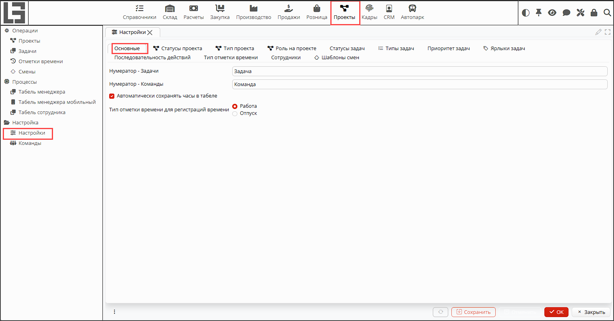
*Рис. 1 Форма настройки проектов*

## Вкладка Основные
На вкладке (рис. 1) устанавливаются нумераторы для генерации идентификаторов задач и команд в полях **Нумератор - 
Задачи**, 
**Нумератор - Команды** соответственно. 

**Автоматически сохранять часы в табеле** - модуль [**Кадры**](HR.md) предоставляет возможность автоматической регистрации 
начала и 
окончания времени работы сотрудника. Если данное свойство отмечено флажком, то зарегистрированное время будет 
автоматически добавлено в табель сотрудника.

**Тип отметки времени для регистрации времени** - при автоматическом сохранении зарегистрированных часов в табеле 
сотрудника они должны быть отмечены определенным типом времени, например, как  часы работы или отдыха. В данном поле 
указывается тип отметки времени, который будет назначен автоматически зарегистрированным часам. 

## Вкладка Статус проекта
На вкладке (рис. 2) можно создать удобные для использования статусы проектов, отображающие жизненный цикл проектов.  
Создавать можно неограниченное количество статусов. Для создания используйте кнопку **+Добавить**. В открывшейся 
форме укажите (рис. 3):
- **Имя** - название статуса
- **Код** - уникальный идентификатор
- **Закрыт** - признак, что текущий статус означает, что проект больше не активный, завершен или  отменен. Закрытые 
  проекты по умолчанию не отображаются в списке проектов.

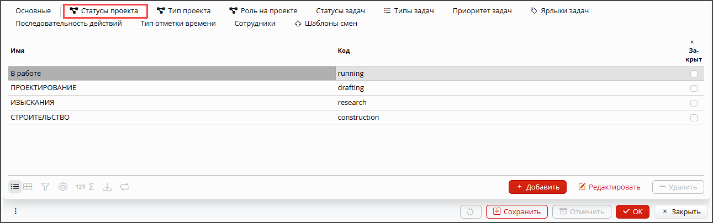
*Рис. 2 Вкладка Статус проекта*

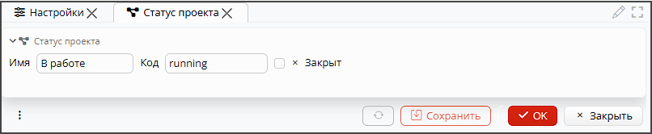
*Рис. 3 Настройки статуса проекта*

## Вкладка Тип проекта
Вы можете настроить необходимое вам количество типов проекта (рис. 4). Тип проекта может отличаться особенностями 
закупок, 
производства, оказания услуг, в рамках проекта, а также жизненным циклом и другими особенностями. Для каждого типа 
проекта можно настроить следующие параметры (рис. 5):
- **Имя** - наименование типа проектов.
- **Код** - уникальный идентификатор типа проектов.
- **Нумератор** - нумератор для генерации номера каждого проекта данного типа.
- **Тип заказа поставщику**, **Тип поступления**, **Тип приемки**, **Тип заказа покупателя**, **Тип реализации**, 
  **Тип отгрузки**, **Тип заказа на производство** - в этих полях можно задавать тип соответствующего документа. Все 
  эти виды документов могут быть привязаны к проекту, также их можно создавать из формы проекта. В случае создания 
  документа из проекта автоматически применится настроенный для типа проекта тип документа. 

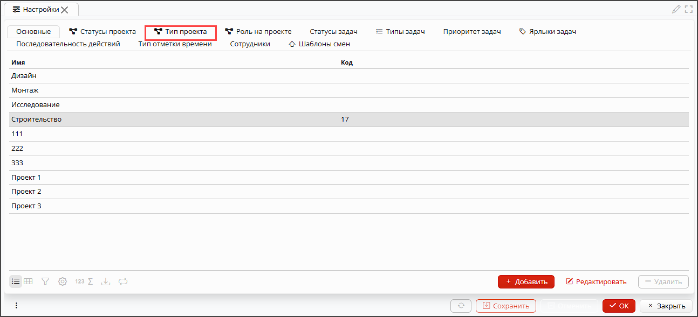
*Рис. 4 Вкладка Тип проекта*

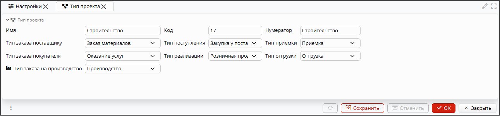
*Рис. 5 Настройки типа проекта*

## Вкладка Роль на проекте
На этой вкладке вы можете определить любое количество ролей, которые выполняют ваши сотрудники и клиенты на проекте 
(рис. 6). 
Для добавления роли нужно указать только **Имя** и **Код** (рис. 7). 

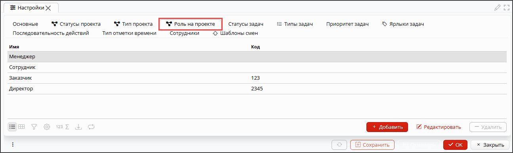
*Рис. 6 Вкладка Роль на проекте*

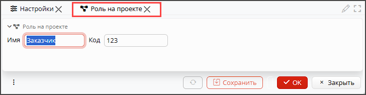
*Рис. 7 Настройка роли на проекте*

## Вкладка Статусы задач
На этой вкладке настраиваются статусы, которые отражают жизненный цикл задач на проекте. Обратите внимание, что для 
каждого типа задач может быть определен свой набор статусов, однако все необходимые статусы должны быть настроены на 
этой вкладке (рис. 8).
Для статуса задачи нужно указать (рис.9):
- **Имя** - название статуса
- **Код** - уникальный идентификатор
- **Порядок сортировки** - порядок отображения в списке статусов
- **Закрыт** - признак, что текущий статус означает, что задача больше не активна, завершена или  отменена. Закрытые
  задачи по умолчанию не отображаются в списке задач. 

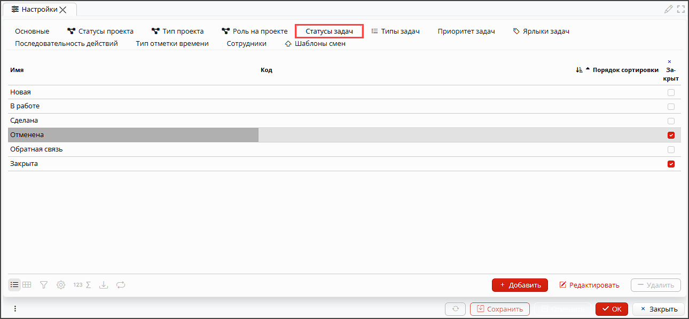
*Рис. 8 Вкладка Статусы задач*

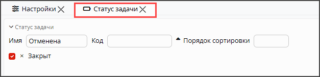
*Рис. 9 Настройка статуса задач*

## Вкладка Типы задач
Вы можете классифицировать задачи по типам. Для этого настройте нужное количество типов задач на этой вкладке.  Для 
каждого типа задач укажите **Имя**, уникальный **Код** и отметьте [**Статусы**](#вкладка-статусы-задач), которые определяют жизненный цикл 
типа задач. Если ни один статус не отмечен, то все статусы будут доступны для типа задач.

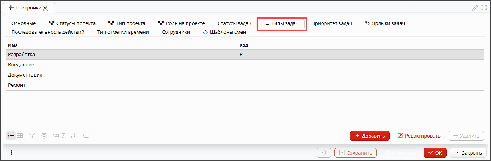
*Рис. 10 Вкладка Типы задач*

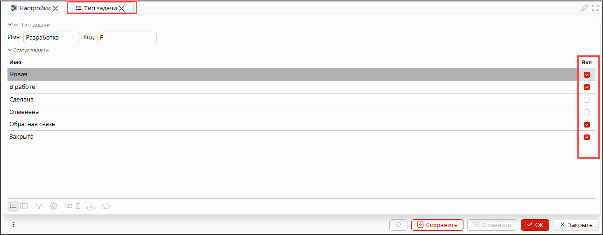
*Рис. 11 Настройка типа задачи*

## Вкладка Приоритет задач
Чтобы ранжировать задачи по приоритету, на этой вкладке нужно настроить все необходимые приоритеты (рис. 12). Для 
приоритета 
укажите (рис. 13):
- **Имя** - название приоритета.
- **Код** - уникальный идентификатор.
- **Цвет** - вы можете выбрать цвет из доступной палитры, которым будут выделяться задачи с текущим приоритетом.

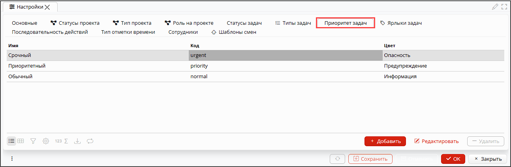
*Рис. 12 Вкладка Приоритеты задач*

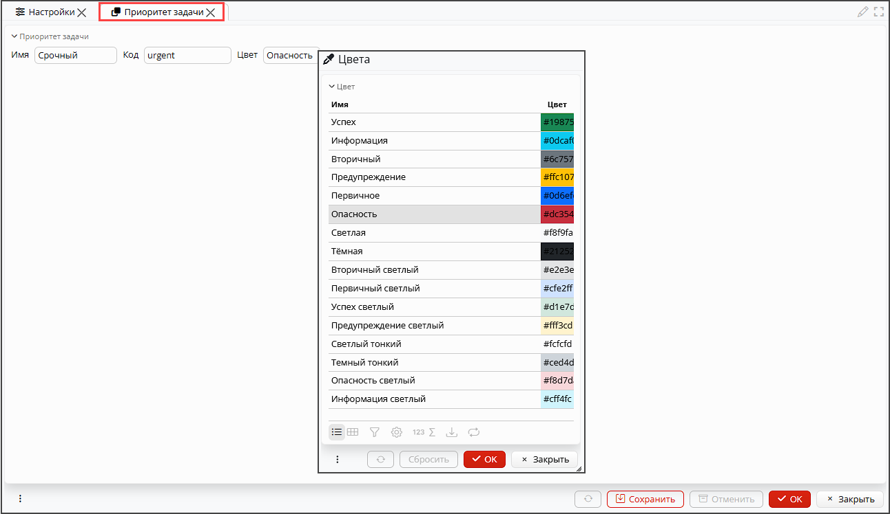
*Рис. 13 Настройка приоритета задачи*

## Вкладка Ярлыки задач
Если для классификации задач недостаточно типов и приоритетов, то можно настроить ярлыки, которыми можно помечать 
задачи (рис. 14).
Для ярлыка нужно указать **Имя**, **Код** и **Цвет** (рис. 15).

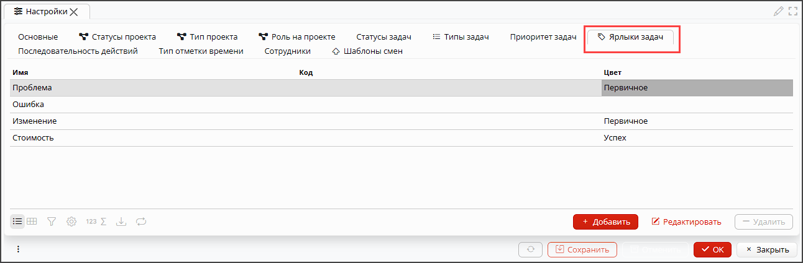
*Рис. 14 Вкладка Ярлыки задач*

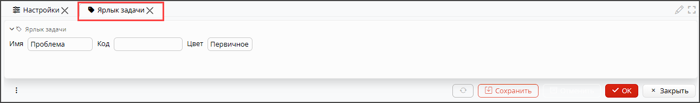
*Рис. 15 Настройка ярлыка задачи*

## Вкладка Последовательность действий
На вкладке настраивается, через какие статусы проходит задача в процессе выполнения, в зависимости от типа задачи и 
роли сотрудника, который ее создает или назначает.

В первую очередь нужно выбрать **Роль на проекте** и **Тип задачи**, для которых настраивается последовательность. 

Далее, в таблице статусов задач нужно отметить для каждого статуса, на какой статус он может быть изменен. Эта 
настройка будет действовать для выбранного типа задач для всех пользователей с заданной ролью на проекте. 

Если для автора и исполнителя задачи последовательность изменения статусов должна различаться, то последовательность 
для автора настраивается в блоке **Автор**, а последовательность для исполнителя настраивается в блоке **Назначена на**. 

Если ни в одном блоке не отмечены настройки, значит и автор и исполнитель с заданной ролью могут переводить задачи с 
выбранным типом в любой статус в любой последовательности.

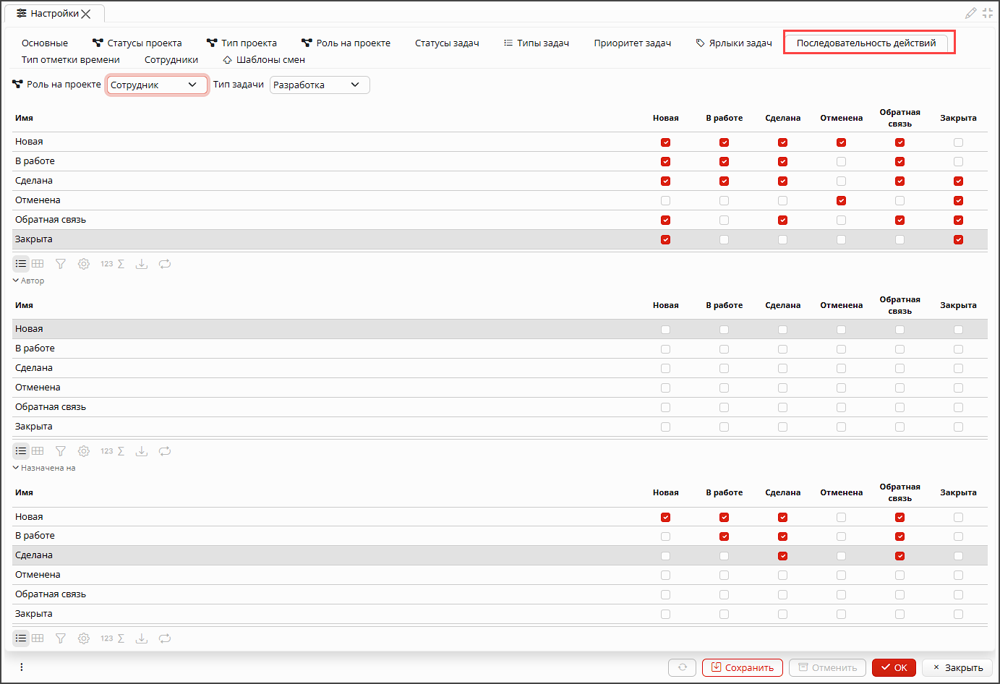
*Рис. 16 Настройка последовательности работы с задачами*

## Вкладка Тип отметки времени
В программе есть возможность отмечать (фиксировать) время сотрудника, затраченное на работу, отдых или иной значимый 
вид 
деятельности. Чтобы вести учет, сколько часов каким видом деятельности занимался сотрудник, нужно определить и 
настроить типы отметки времени (рис. 17). 

Для типа отметки времени нужно указать(рис. 18):
- **Имя** - название вида деятельности.
- **Код** - уникальный идентификатор.
- **По умолчанию** - такая отметка времени будет заполнятся автоматически на основании данных по регистрации  
  рабочего времени.

[//]: # (todo: добавить ссылку на описание регистрации рабочего времени)

- **Цвет** - вы можете выбрать цвет из доступной палитры, которым будут выделены отметки времени данного типа.
- **Символ** - укажите символ, которым сокращенно будет обозначаться тип отметки времени.
- **Обязательный проект** - если отмечено флажком, то для сохранения отметки времени обязательно должен быть указан 
  проект, к которому относится вносимая отметка времени
- **Часы отметки времени** - здесь можно сформировать список наиболее часто используемых отметок времени текущего 
  типа, чтобы вносить их в табель одним кликом. Для создания стандартных часов отметки времени:
  - нажмите кнопку **+Добавить**, появится пустая строка
  - заполните **Имя** стандартных часов отметки времени
  - укажите количество отработанных **Часов**
  - при желании выберите **Цвет**, которым они будут отображаться в табеле.

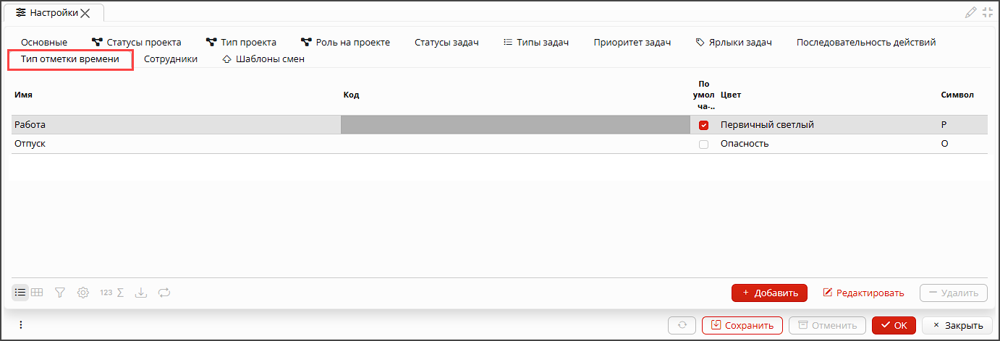
*Рис. 17 Вкладка Типы отметки времени*

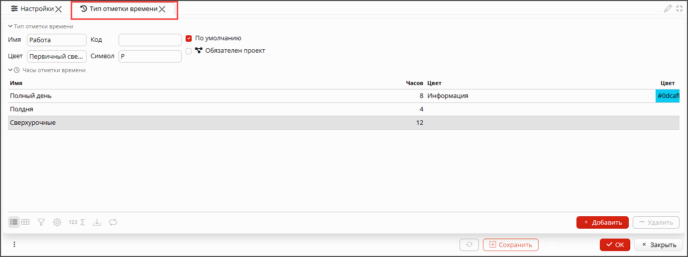
*Рис. 15 Настройка типов отметки времени*

## Вкладка Сотрудники
На этой вкладке (рис. 19) отображается список всех сотрудников. Для каждого сотрудника можно указать **Услугу**, 
которую они  
оказывают заказчикам. В этом случае, время, которое сотрудник отработал на проекте, будет выставлено заказчику в 
реализации как стоимость оказанных услуг.

[//]: # (todo - вставить ссылку на создание реализации в проекте) 

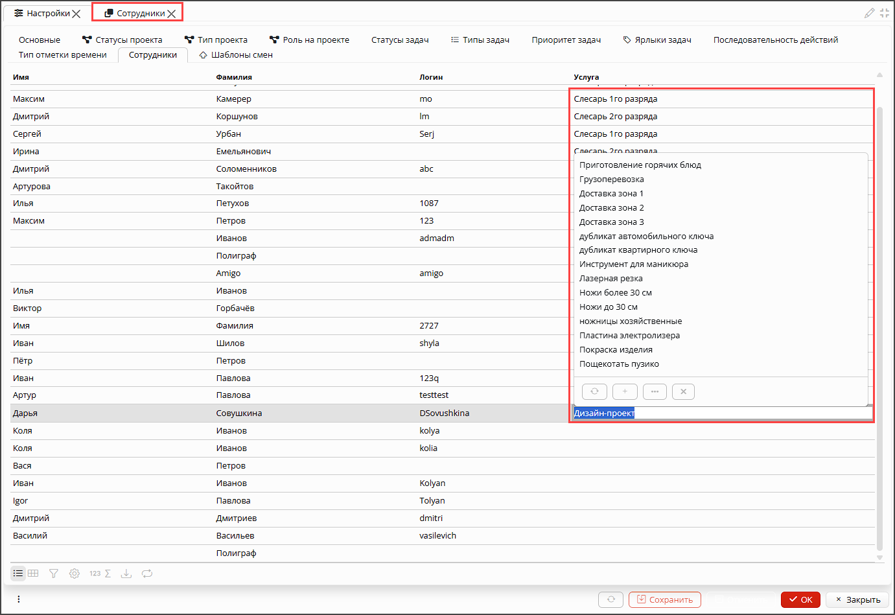
*Рис. 19 Настройка оказания услуг сотрудниками*

## Вкладка Шаблон смен
На вкладке можно задать стандартные смены, с помощью которых при планировании рабочего времени назначение смен 
сотрудникам производится в один клик.

Чтобы создать стандартную смену, нажмите кнопку **+Добавить** и в появившейся строке внесите время начала и окончания смены.

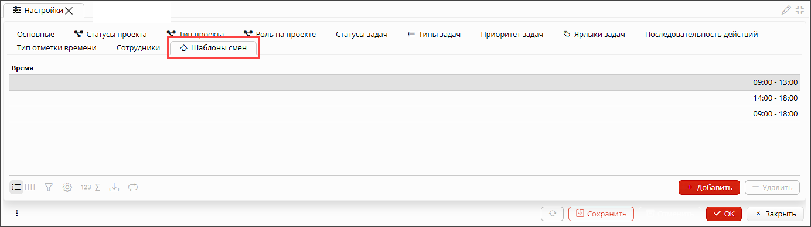
*Рис. 20 Настройка шаблонов смен*

