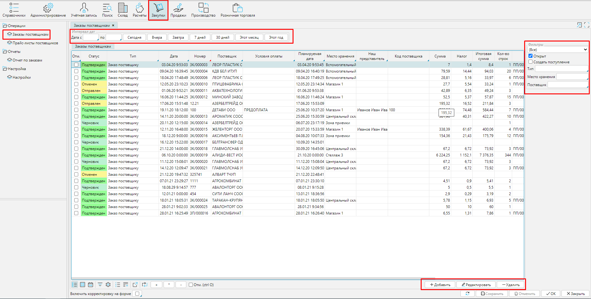
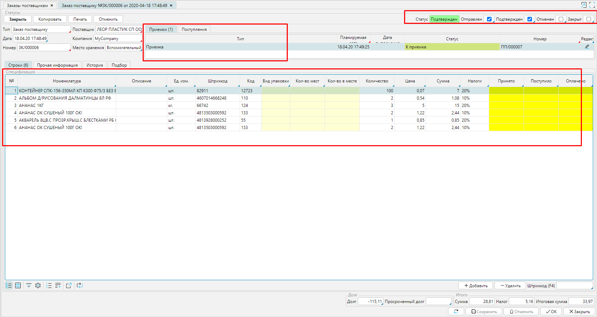
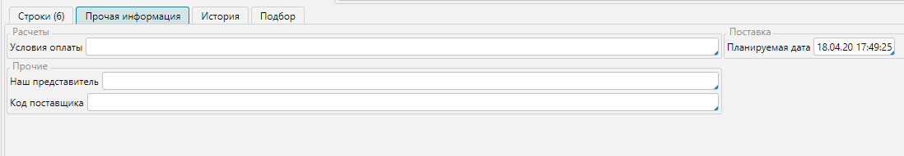
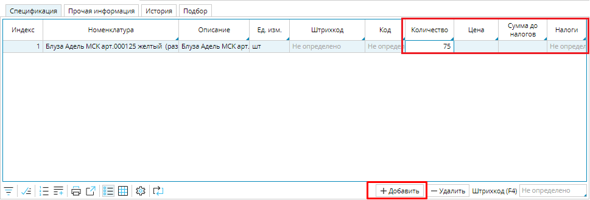
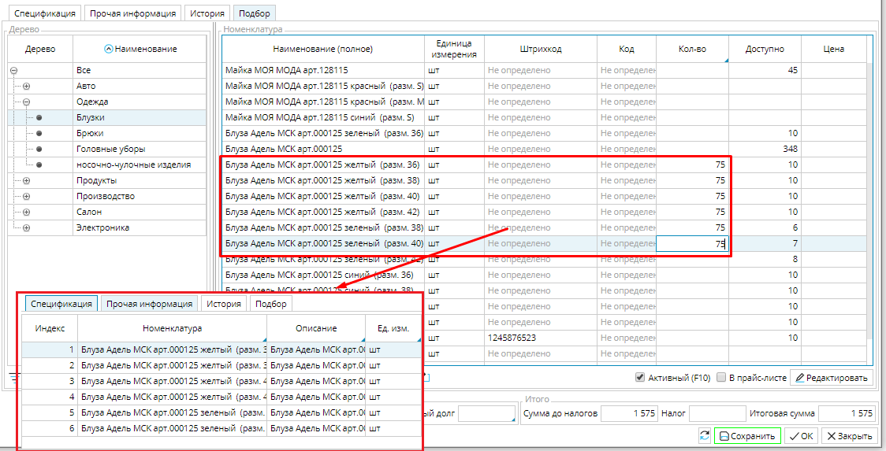
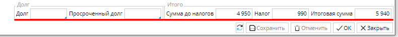

Для заказа товаров  используется **Заказ поставщику**. Все ваши заказы отображаются в **Закупки-Заказы поставщикам**. Для удобства навигации заказы на каждой стадии жизненного цикла выделяются определенным цветом. Создание  и редактирование заказов осуществляется соответствующими кнопками в правом нижнем углу. Для легкой навигации по заказам в верхней части формы можно установить период, за который будут отображаться заказы, сбоку доступны другие быстрые фильтры, например по типу, поставщику и др.  

  
Рис. 1 Список заказов поставщикам

  

Чтобы открыть **Заказ**, кликните на него 2 раза в списке, или нажмите кнопку **Редактировать**. Чтобы создать новый заказ, используйте кнопку **Добавить**.  Форма **Заказа поставщику** дает пользователю возможность увидеть сразу всю важную информацию: дату заказа, поставщика, список заказанных товаров и их стоимость, статус заказа, был ли уже получен товар, есть ли задолженность перед поставщиком.  Это существенно экономит ваше время.

  
Рис. 2 Форма заказа поставщику

  

Для быстрой и корректной работы с заказом тщательно заполните необходимую информацию в полях формы.  Если у вас настроены **[Контрагенты](Partners_directory.md) **и **[товары](Items_directory.md)**, большая часть информации будет заполнена автоматически.

  

**Тип** -  выберите тип из списка, который откроется по клику.  Если нужного типа нет, добавьте с помощью кнопки Добавить или настройте в Закупки - Типы заказов. От выбранного типа заказа будет зависеть, какие  документы будут созданы на основе заказа,  и иные параметры. Наиболее распространенный тип - закупка у поставщика с последующим размещением на своем складе.  

**Дата **- в новом заказе в поле автоматически указана дата и время создания. Их можно изменить по необходимости.

Будьте внимательны и указывайте не только дату, но и время заказа, т.к. это важно при партионном учете товара. 

**Номер** заказа также будет автоматически создан при первом сохранении, если вы настроили **[нумераторы](Numerators.md)**. 

Выберите ** Поставщика **из списка **Контрагентов**, который откроется по клику в поле. 

**Компания** - укажите компанию-покупателя.

**Место хранения** - укажите склад или конкретную зону склада, где будет хранится закупленный товар.  Подробнее о настройке мест хранения можно найти **[здесь](Location_settings.md)**.

  
Рис. 3 Вкладка Прочая информация 

  

Во вкладке **Прочая информация**  укажите:

**Условия оплаты** - если у поставщика указано условие оплаты по умолчанию, то поле заполниться автоматически. Если нет, или для данной закупки будет действовать другое условие, кликните в поле и выберите условие оплаты из списка.  Если подходящего нет, создайте его с помощью кнопки **Добавить**.

**Наш представитель** - сотрудник, который будет ответственным за эту закупку.  Выберите ** **из списка **Контрагентов**, который откроется по клику в поле.

**Входящий номер поставщика** - номер,за которым данная закупка учтена у поставщика.  Если вы знаете этот номер, он может существенно облегчить коммуникацию с вашим партнером при возникновении необходимости быстро идентифицировать данную закупку, например, при сверке данных.

**Планируемая дата** - по умолчанию здесь проставляется дата и время создания заказа. Укажите предполагаемый срок поставки.

## **Добавление списка товаров** 

Товары, которые вы покупаете отображаются во вкладке **Спецификация**. Вы можете использовать 2 способа создания спецификации товаров :

 <u>***1. Добавление товаров по одному.***</u> Нажмите **Добавить** во вкладке спецификации, появиться пустая строка. кликните в столбце **Номенклатура**, и выберите товар в открывшемся окне номенклатур. Товар отобразиться в строке. Введите количество в соответствующем столбце. 

### Рис. 3 Вкладка Спецификация

  

<u>***2. Добавление товаров списком.***</u> Перейдите во вкладку **Подбор**. В правом блоке будут отображены все товары из **Категории**, выбранной в левом блоке.  Все товары, для которых вы укажете количество, будут автоматически отображены в спецификации. В столбце ***Доступно*** показано количество товаров, которые есть в вашем распоряжении, т.е. находятся на складе и не зарезервированы для определенных покупателей. Эта информация позволит вам оперативно скорректировать количество товара для закупки.

  
Рис. 4 Вкладка Подбор

  

 Осталось ввести цену товара, и налоги, которые начисляются на товары. Эти данные также могут быть автоматически заполнены. **Цена** товара отображается, если у вас загружен **[прайс-лист](Vendor_pricelists.md)** на этот товар данного поставщика, или указана цена в **[карточке товара](Items_directory.md)** при плановом методе расчета себестоимости. Налоги проставляются автоматически, если указаны в **[карточке товара](Items_directory.md).** В зависимости от настроек типа заказа цена будет отображаться с учетом или без учета налогов. 

  

Когда все данные в заказе заполнены, в поле итогов отображается стоимость закупки. Кроме того, в полях **Долг/ Просроченный долг** отображаются взаимные задолженности.  Если в поле положительная сумма, то это задолженность поставщика перед вами, соответственно, можно, например, применить взаимозачет. Если сумма отрицательная, значит у вас уже есть неоплаченные обязательства перед данным поставщиком. 

  

Новый заказ по умолчанию имеет статус ***Черновик***, который отображается в блоке **Статусы**. Заказ может находиться в одном из 5 статусов, которые однозначно показывают пользователю на каком этапе находится процесс закупки. Переход между статусами осуществляется посредством выполнения определенных действий.  

|Статус|Возможные действия|Описание |
|---|---|---|
|*<strong>Черновик</strong>* |
<strong>Отправить</strong>/Подтвердить/Копировать/<strong>Печать </strong>
|
В статусе черновика вы указываете существенные данные для будущей сделки, например, указываете поставщика, формируете список товаров в заказе, указываете  сроки поставки и т.д. Далее вы можете отправить заказ поставщику для согласования деталей, например цены или условий оплаты, для этого выбираете действие <strong>Отправить</strong> и заказ переходит в статус *<strong>Отправлен</strong>*. 
 
Вполне вероятно, что у вас уже есть определенные договоренности с поставщиком, вы точно можете указать все существенные условия, тогда заказ можно сразу <strong>Подтвердить</strong>, соответственно, он перейдет в статус *<strong>Подтвержден</strong>*.
 
<strong>Копировать</strong> - создает копию заказа
 
<strong>Печать</strong> - позволяет вам вывести на печать или сохранить в формате pdf "бумажный" документ заказа для последующего использования.
|
|<strong>Отправлен</strong>|<strong>Подтвердить</strong>/<strong>Отменить</strong>/Копировать/<strong>Печать </strong>|
Когда вы уточнили и согласовали все детали закупки с поставщиком, подписали договор и внесли данные в заказ, нажимайте <strong>Подтвердить</strong>, заказ перейдет в статус *<strong>Подтвержден </strong>*и будет создано <strong>Поступление</strong>. 
 
Если вы не пришли к согласию с поставщиком, и сделки не будет, вы можете <strong>Отменить</strong> заказ.  По наличию/количеству отмененных и выполненных заказов вы можете анализировать своих поставщиков.
|
|<strong>Подтвержден</strong>| <strong>Закрыть</strong>/<strong>Создать поступление</strong>/<strong>Отменить</strong>/Копировать/<strong>Печать</strong>|
По подтвержденному заказу получают и оплачивают товар. После того, как вы оформили <strong>Приемку</strong> вы можете <strong>создать Поступление</strong> на поставленные товары - система создаст документ [<strong>Поступление</strong> ](Vendor_payments.md)на принятое количество товара. 
 
Если, по каким-то причинам на данной стадии заказ не может быть выполнен, его можно <strong>Отменить </strong> и напечатать, например, для формирования отчетности. 
 
Выполненный заказ, который получен, размещен и оплачен, можно <strong>Закрыть.</strong>
|
|<strong>Закрыт</strong>|<strong>Отменить</strong>/Копировать/<strong>Печать</strong>|Выполненный заказ при необходимости можно [<strong>Отменить</strong>](Purchase_order_cancellation.md) или напечатать.|
|<strong>Отменен</strong>|<strong>Печать</strong>|Отмененный заказ можно напечатать для отчета или других нужд.|

  

  

  
