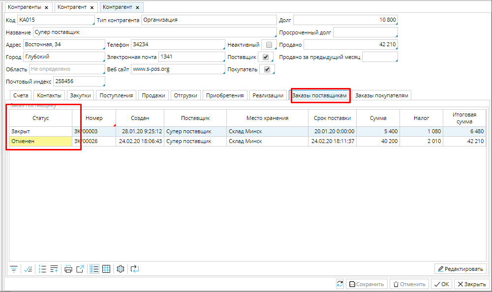
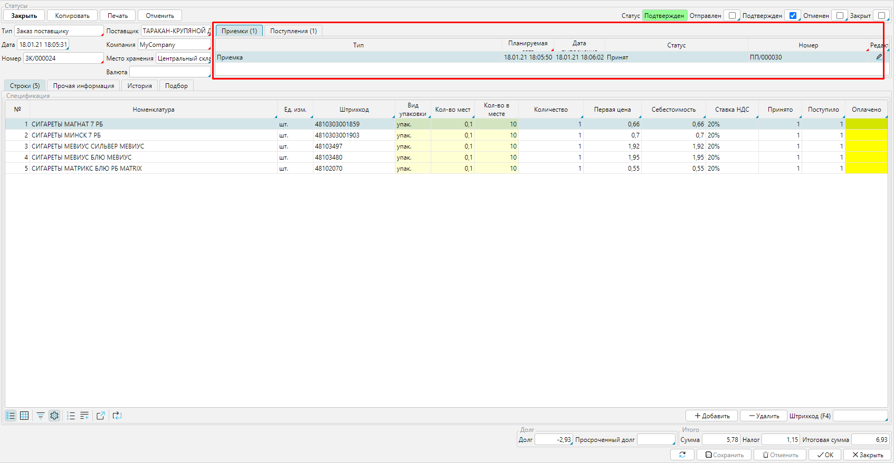
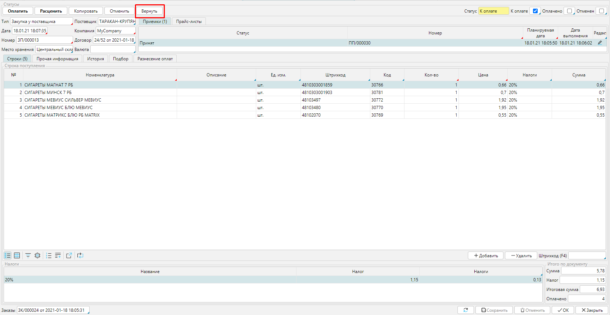
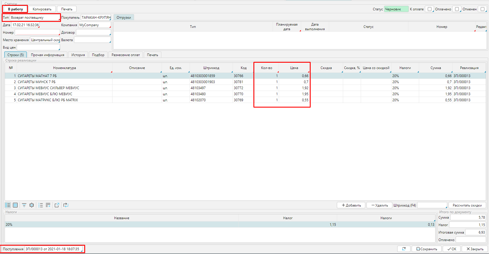
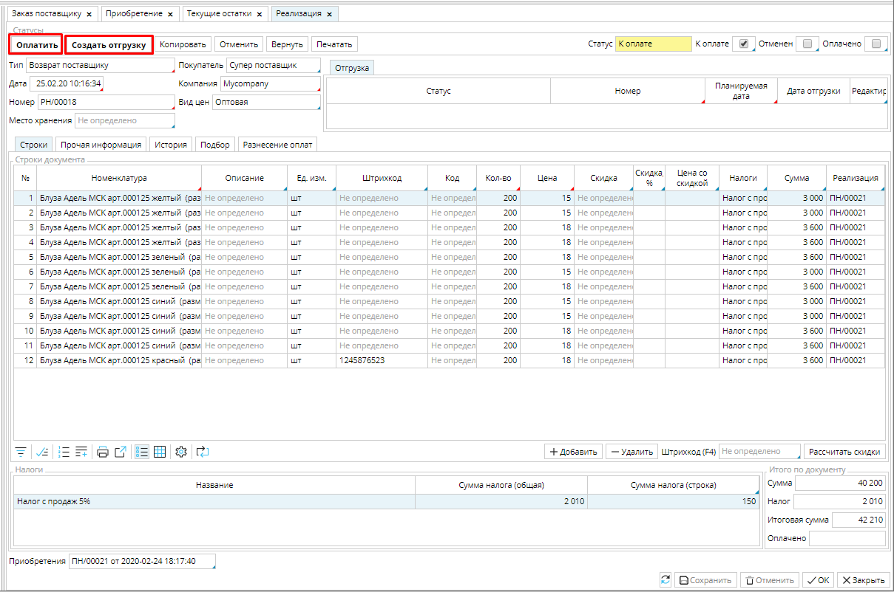
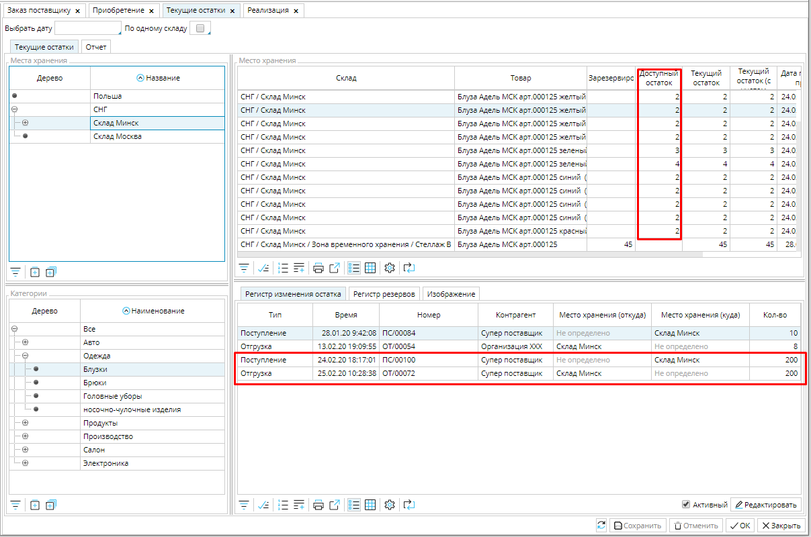
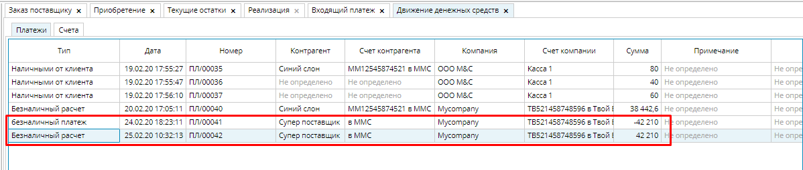
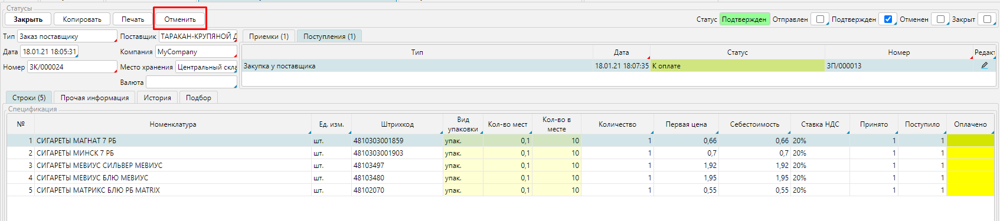

Всегда есть вероятность, что сделка между партнерами может сорваться по вине одного из них, либо по объективным причинам. Если сделка расторгается, то, соответственно **Заказ,** отражающий в системе эту сделку, должен быть завершен. С момента подтверждения заказа, его можно завершить двумя способами: закрыть и его финальный статус будет ***Закрыт***, или отменить, и его конечный статус будет ***Отменен***. 

Если вы будете ***Закрывать*** те заказы, которые были выполнены, либо отменены по вашей инициативе, а заказы, которые не были выполнены по вине партнера ***Отменять***, то вы сможете оценить благонадежность своего партнера просто взглянув на соотношение закрытых и отмененных заказов. 

  
Рис. 1 Список заказов поставщика в карточке Контрагента

  

При отмене Заказа, по которому уже произошла поставка, были учтены и оплачены товары, возникает необходимость возврата товара и средств. Например, если партия товаров оказалась бракованной. Поэтому, прежде, чем отменить заказ, проверьте, обработаны ли связанные с заказом документы. 

Рис. 2 Ссылка на приемку и поступление в Заказе

  

Если товары по заказу учтены и оплачены, то откройте **Поступление** - дважды кликните по документу в **Заказе**. 

  
Рис. 3 Функция Вернуть в Приобретении 

  

В **Поступлении** используйте функцию **Вернуть**. Нажмите на эту кнопку и будет создан документ **Реализация** с установленным [типом ***Возврат поставщику***](Invoice_type.md)  на все количество  и стоимость товара. Проверьте записи в Реализации и принимайте **В работу**.  Для удобства документ, на основании которого создана реализация, указан внизу формы. 

  
Рис. 4 Документ Реализация

  

  
Рис. 5 Оплата и отгрузка по Реализации

  

Создайте отгрузку, когда отправите товар обратно поставщику, и платеж, когда вам вернут оплату.  Таким образом вы снимете товар с учета и восстановите баланс денежных средств. 

  
Рис. 6 Движение возвращенного товара по складу

  

  
Рис. 7 Движение денежных средств

  

Теперь, когда вы проверили, что все необходимые возвраты отражены в системе, можете **Отменить** заказ.

  
Рис. 8 Отмена заказа

  

  
