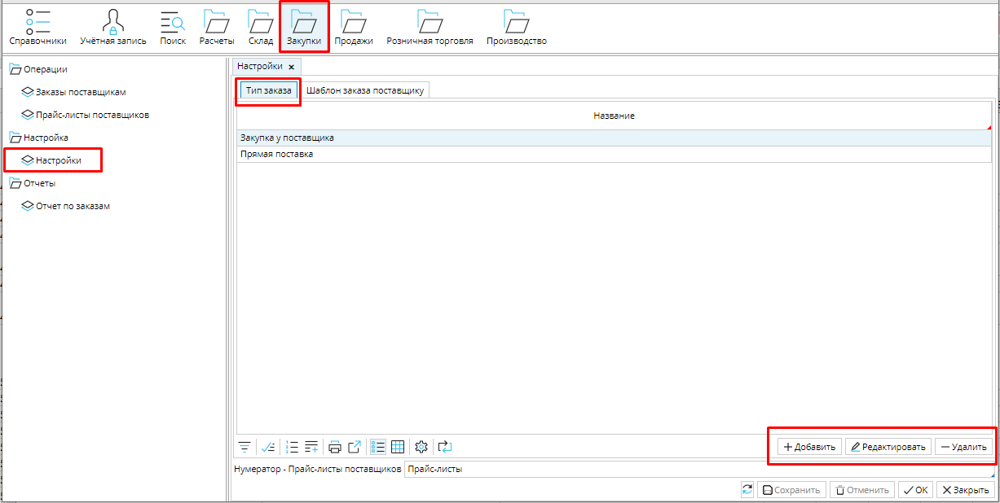
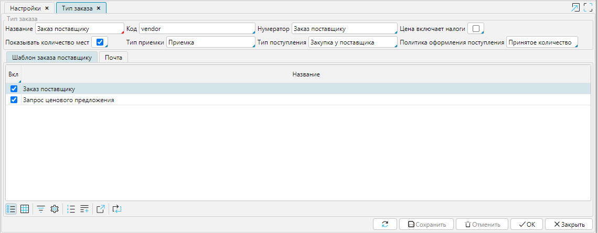
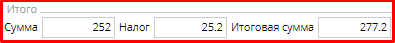
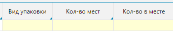

В **Закупки - Настройки** на вкладке **Тип заказа** вы можете настроить все типы заказов на закупку, которые используете в своей деятельности. Например, закупка у поставщика.

  
*Рис. 1 Список типов заказа на закупку*

  

Чтобы настроить тип заказа нажмите кнопку **Добавить** и установите подходящие настройки.

  
*Рис. 2 Настройка типа заказа на закупку*

  

**Название** - используйте понятное вам и сотрудникам имя для типа заказа.

**Нумератор** - укажите нумератор, который будет использоваться для создания уникального номера заказа. О настройке нумераторов читайте [**здесь**](Numerators.md).

**Цена включает налоги** - включите этот признак (поставьте галочку), если вы указываете в системе цену товара, которая уже включает в себя налог, тогда итоговая стоимость заказа будет выглядеть так: . Если этот признак выключен (галочка не стоит), то итоговая стоимость заказа будет выглядеть так: .

**Показывать количество мест** - если этот признак включен, то в заказе будут доступны колонки . 

**Тип приемки**- выберите тип приемки из списка настроенных. Документ Приемки этого типа будет создаваться автоматически, при переводе заказа в статус Подтвержден. Если вы оставляете это поле пустым, то приемка не будет создаваться автоматически. Подробнее о типах приемки читайте [**здесь**](Receipt_type.md).

**Тип поступления** - выберите тип из списка настроенных. Документ **[Поступление](Vendor_payments.md)** этого типа будет создаваться на основе заказа. Подробнее о типах поступлений читайте [**здесь**](Bill_type.md).

**Политика оформления поступления**- если вы устанавливаете ***Принятое количество***, то  документ **Поступления** будет создан только на то количество товара, которое вы получили от поставщика по документу **Приемки**. Если вы устанавливаете ***Заказанное количество***, то  документ **Поступления** будет создан на все количество товара, которое указано в заказе, независимо от того, сколько товара получено.

Сохраните настроенный тип заказа на закупку.

  

  
