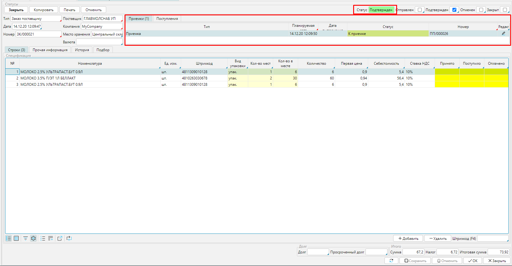
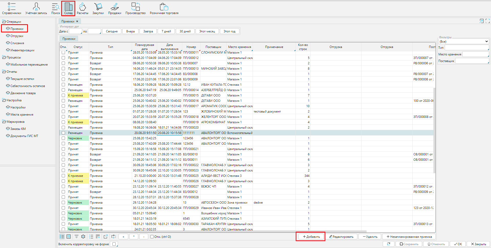
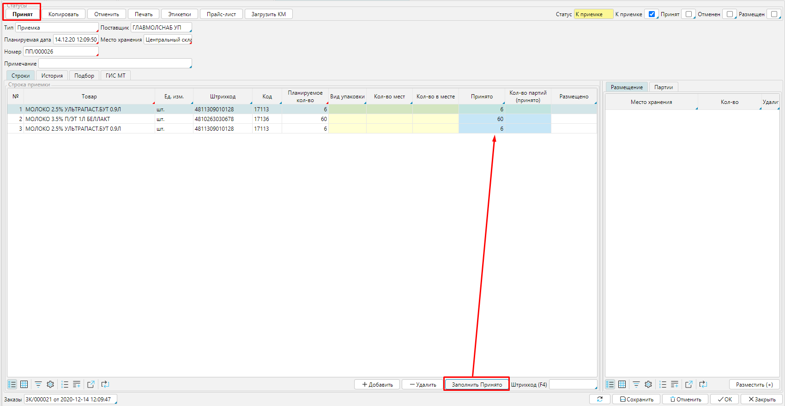
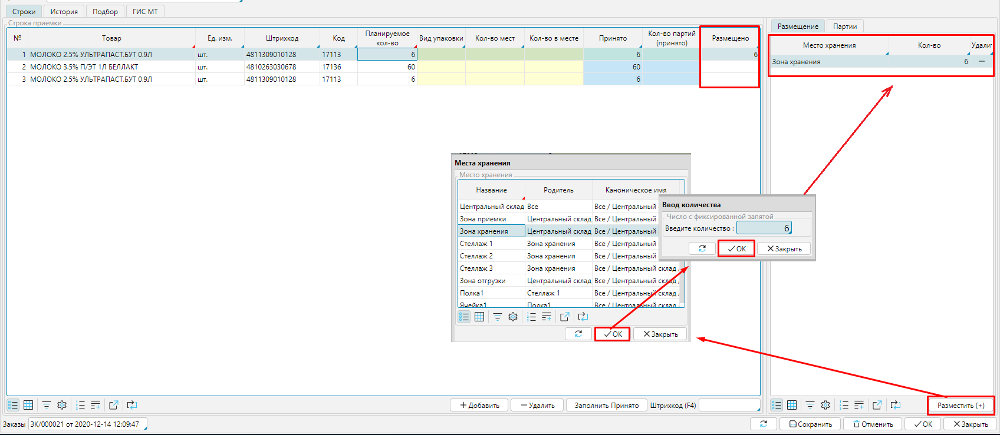

  Когда **Заказ** переведен в статус ***Подтвержден***, автоматически создается **Приемка **в статусе ***К приемке*** на заказанное количество товара (см. настройки **[типа заказа](Purchase_order_type.md)**). **Приемка **также будет отображаться в общем списке  документов приемки  в модуле **Склад - Приемки**. 

  

  
Рис. 1 Подтвержденный заказ

  

  

  
Рис. 2 Список поступлений

  

Когда товары к вам поступают, вы обрабатываете **Приемку**, чтобы  на складе увеличились остатки принятых товаров. Вы можете открыть документ  из формы заказа или из общего списка. 

В документе автоматически указан **Тип** приемки, который настроен в **[типе заказа](Purchase_order_type.md)**. Перечень **[типов приемок](Receipt_type.md) ** вы также можете настроить самостоятельно.

**Место хранения** будет указан тот же, что и в заказе.

В столбце **Принятое количество** необходимо проставить, сколько поступило  товаров. Если все соответствует заказу (**Планируемое количество**), то нажмите кнопку **Заполнить Принято** и в столбце проставится заказанное количество. 

Нажмите **Принят** и статус поступления изменится на ***Принят***, остаток  товаров на складе увеличится, в заказе можно будет создать **[Поступление](Vendor_payments.md)**  для учета товаров.  

   
Рис. 3 Прием товаров

  

Когда товар принят, его можно разместить, т.е. определить конкретное место на складе, где он будет находиться. Для этого выделите товар в списке, нажмите **Размещен**, выберите [**место хранения**](Location_settings.md) из открывшегося списка и введите количество товара, которое будет храниться в этом месте. В зависимости от ваших  планов, товар, например,  может быть помещен на хранение, или  направлен сразу в зону отгрузки, чтобы формировать поставку покупателям, или распределен частями в разные зоны склада. Для каждого принятого наименования в блоке **Размещение** будет отображаться  место нахождения и сколько товаров там размещено.  Когда вы указали место хранения для всех поступивших товаров, измените статус поступления на ***Размещен*** соответствующей кнопкой в левом верхнем углу и товары будут числиться в указанных местах хранения.

 Функция размещения товара будет доступна, если настроена для используемого [**типа поступления**](Receipt_type.md). 

  
Рис. 4 Размещение товаров

  

Приемку можно создать и без заказа, использую кнопку **Добавить** (см. рис. 2), тогда все данные, такие как поставщик, тип документа, место хранения, спецификация и количество товаров, и др. необходимо будет заполнить вручную. 

  

  

  
