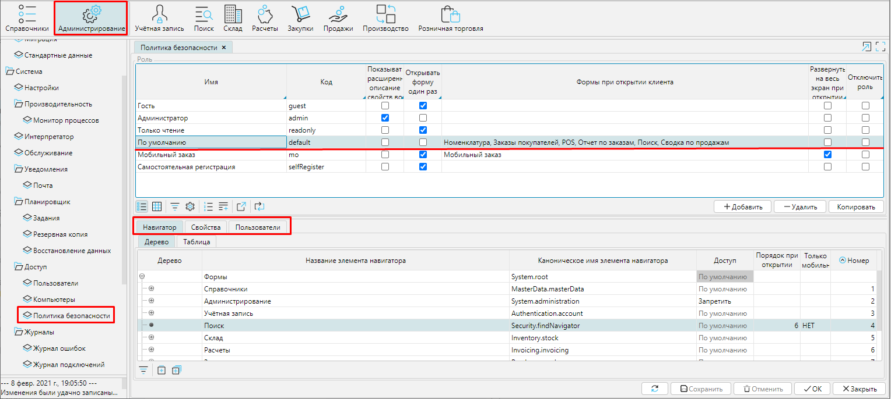
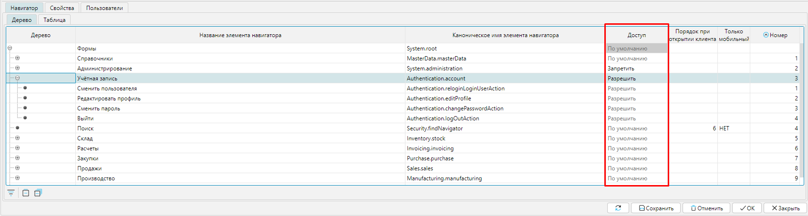
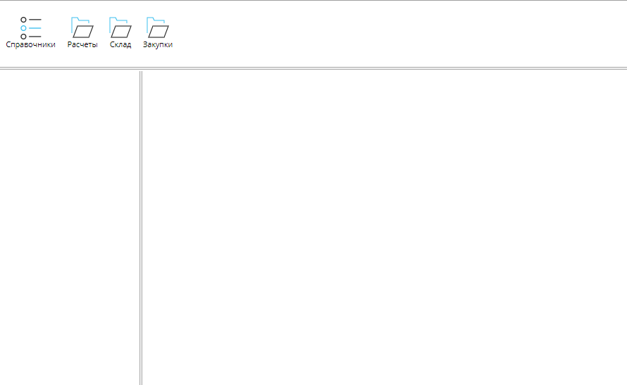
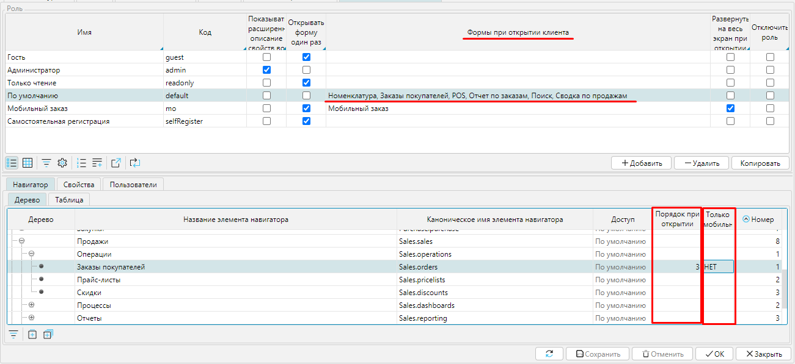
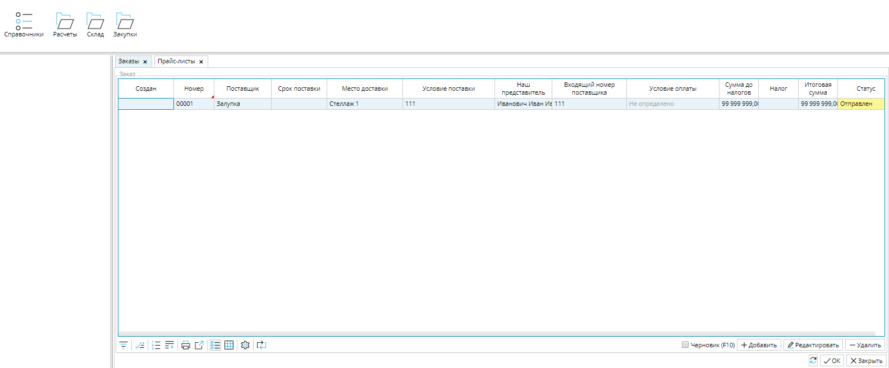
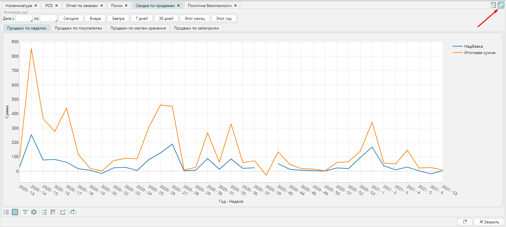
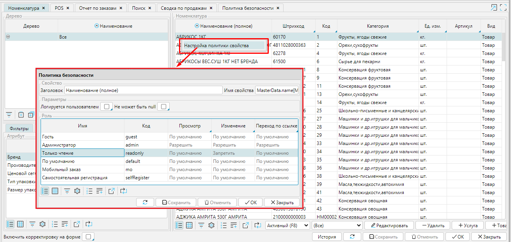
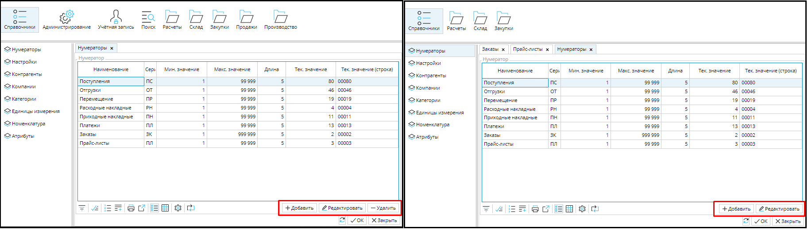

Набор функциональных возможностей, доступных каждой Роли определяется назначенными ей Правами. 

 Редактирование прав осуществляется в модуле **Администрирование** -  вкладка **Политика безопасности**.

Для каждой роли необходимо настроить доступ к элементам навигатора и Свойствам на соответствующих вкладках. 

 Рис.1 Окно настройки Роли

## **Навигатор**

На вкладке **Навигатор **отображаются все существующие в системе формы. Их можно просматривать  в виде дерева либо в виде таблицы (вкладки **Дерево**/ **Таблица**). В древовидном представлении список форм отражает структуру имеющихся модулей и наиболее удобен для управления доступом к ним. 

Для каждой формы в колонке Доступ можно установить один из трех статусов:

***Разрешить*** - форма будет доступна пользователю

***Запретить** *- форма будет недоступна пользователю

***По умолчанию** *- форма будет доступна пользователю с данной полью. Если у пользователя несколько ролей, форма будет доступна если среди этих ролей есть Разрешить или нет Запретить.

  

  

  
Рис. 2 Настройка доступа Роли к формам

  

#### Рис. 3 Вид пользователя с ограниченными правами доступа к формам

  

Для удобства в работе можно задать форму(ы), которая будет открываться при запуске программы. Для этого выделите роль и в дереве форм навигатора проставьте **Порядок при открытии** для нужной формы. Если должна открываться только одна форма, то для нее номер  будет "1", если несколько, то проставьте номера по порядку. Отмеченные формы отображаются в поле **Формы при открытии** таблицы ролей. 

**Развернуть на весь экран при открытии клиента** - при входе в систему у пользователя будет отображено только  рабочее окно на весь экран без меню навигации. Для отображения меню навигации необходимо  кликнуть на иконку 

Только мобильный - регулирует (значения ДА/НЕТ), будет ли данная форма открываться только на мобильном устройстве.

  

                           

Рис. 4 Настройка формы при открытии                                                                                                                                                                                                                              

   

#### Рис. 5 Вид пользователя с настроенными формами при входе в учетную запись

  
Рис. 6 Вид пользователя с настроенными формами, развернутыми на весь экран

### Свойства

На вкладке **Свойства** отображены все существующие в системе свойства всех форм - это поля, кнопки, чекбоксы и т.д. Они также как и формы имеют иерархическое  (Дерево) и табличное (Таблица) представление.

Для роли может быть установлен один из трех статусов [**доступа**](#Доступ-broken) (Запретить/Разрешить/По умолчанию) на действия в отношении свойств:

**Просмотр** - для пользователя свойство отображается или нет;

**Изменение** - пользователь может или нет изменить значение свойства;

**Редактирование объекта** - если значением свойства выступает объект, пользователь может или нет перейти к редактированию данного объекта. 

Устанавливается статус доступа к свойствам аналогично доступу к формам.  Однако, учитывая большое количество разнообразных свойств в системе, на вкладке Свойства удобно определить  уровень доступа к группе свойств, соответствующей верхним ветвям дерева, либо просмотреть статус допусков роли в разрезе свойств.  

#### Рис. 7 Доступ роли к свойствам

Чтобы определить уровень доступа к конкретному свойству на форме удобно воспользоваться контекстным меню. Для этого необходимо нажать правой клавишей мыши на кнопку или поле, доступ к которому надо настроить и в контекстном меню выбрать Настройка политики свойств. Откроется окно Политики безопасности, в котором можно установить уровень доступа к свойству для каждой роли или  для нескольких, затем нажать ОК. Все изменения, внесенные и сохраненные через контекстное меню, отображаются на вкладке Свойства формы Политика безопасности. 

Таким способом можно настраивать доступ к свойствам элементов любых форм.

       

#### Рис. 8 Настройка доступа Роли к свойствам

  

  

  

#### Рис. 9 Вид пользователей с разными правами доступа

*В целях безопасности системы и сохранности данных рекомендуем оставить право редактировать политику безопасности только администратору.*

## **Пользователи**

На этой вкладке отображены все [**пользователи**](Users.md) системы, которым назначена выделенная роль.

####  Рис. 10 Список пользователей с выделенной ролью. 

  

  
