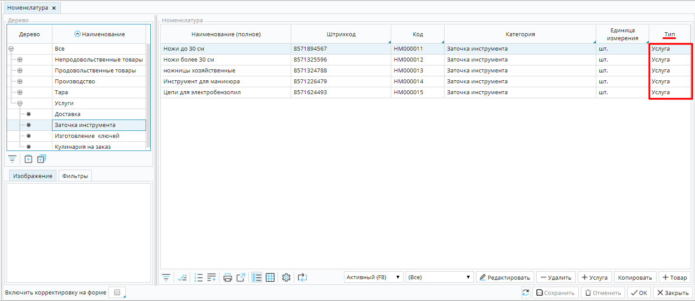
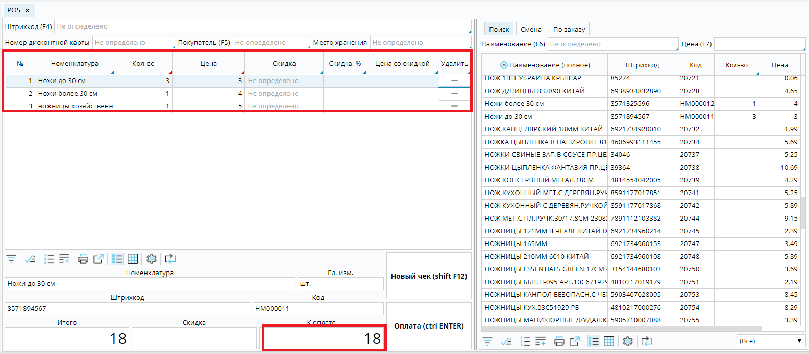
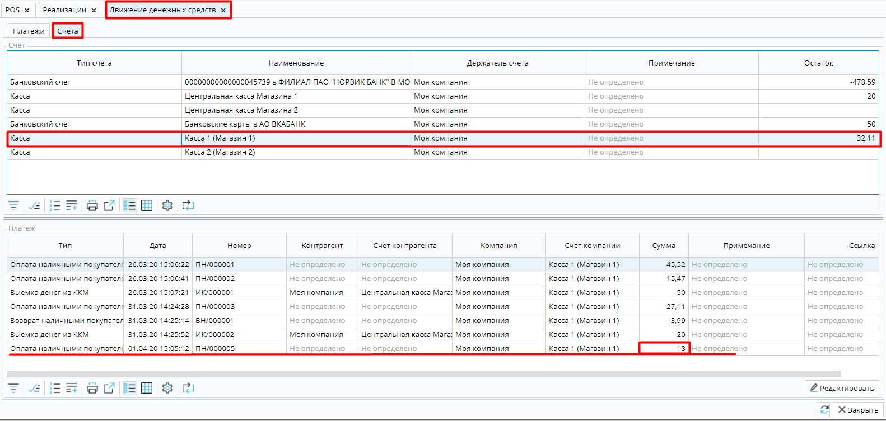
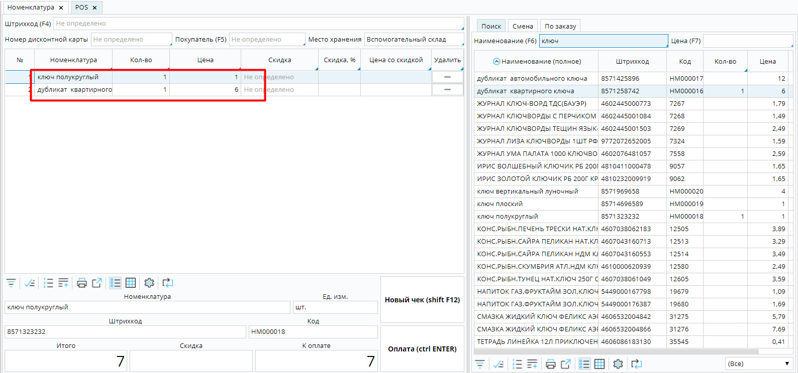
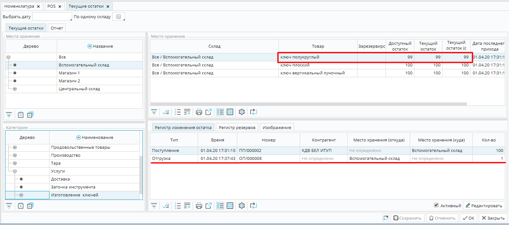
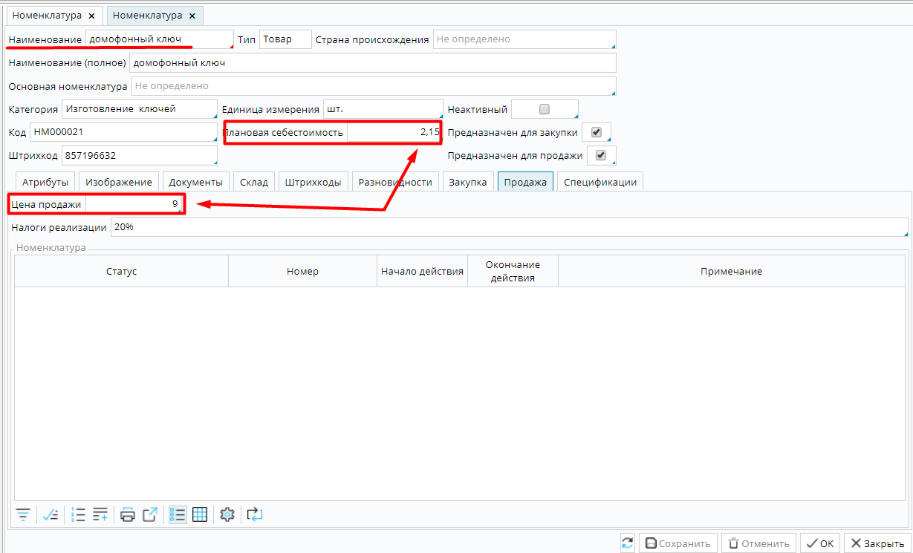
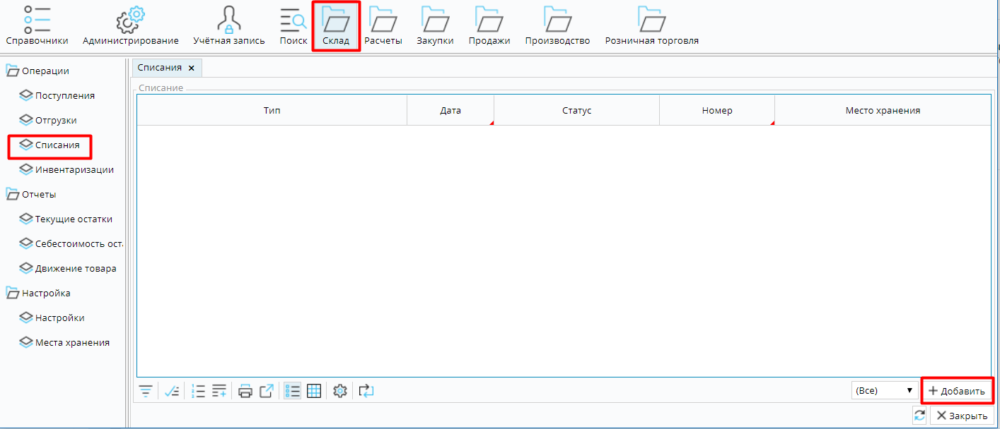
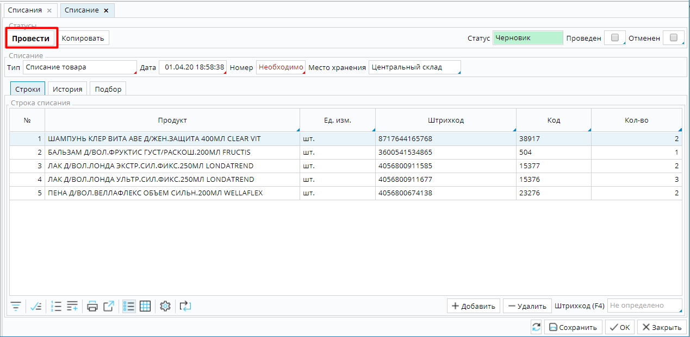

Автоматизация продажи услуг, которые не требуют предварительной подготовки, например заточка инструмента, изготовление дубликатов ключей, оказание парикмахерских или косметических услуг без предварительной записи (стрижка, маникюр и т.п.), аналогична [розничной торговле](Retail.md), но имеет некоторые особенности. 

Во-первых, необходимо создать перечень услуг, которые вы оказываете.  Как создавать услуги описано в статье  [**Настройка номенклатуры**](Items_directory.md).

Для того, чтобы созданный перечень был удобен в применении, надо проанализировать, используете ли вы расходные материалы при оказании услуги, и как вы учитываете их расходование: оформляете расход каждый раз оказывая услугу, или периодически производите списание израсходованных материалов по факту. 

Выбор способа учета оказанных услуг и использованных материалов зависит от особенностей самих услуг и организации вашего бизнеса.

Оказание услуг без использования расходных материалов

Например, услуга "Заточка инструмента" не предполагает использования расходного материала. Поэтому, в системе стоит создать номенклатуры с типом ***Услуга** , *которые  не подлежат складскому учету и при их купле/продаже происходит только движение денежных средств, но не материальных запасов.

  

### Рис. 1 Список номенклатур типа **Услуга**

При продаже вы проводите услуги и их количество по [**кассе**](POS.md) и полученная выручка отображается на ваших [**счетах**](Payments.md#Движениесредствсчета).  

### Рис. 2 Продажа услуг 

  

### Рис 3 Отображение полученной выручки на счетах

Учет расходных материалов в момент оказания услуги

Когда при каждом факте оказания услуги используется заведомо известное и неизменное количество материала, целесообразно учитывать расход материалов в момент продажи услуги. Например, при изготовлении дубликата ключей всегда используется заготовка ключа. Чтобы заготовки списывались автоматически при продаже услуги, возможно несколько вариантов оформления номенклатуры.

**1.**  Необходимо создать номенклатуру типа ***Товар*** для каждого используемого материала и ***Услугу*** для каждого вида выполняемых работ. Тогда при продаже услуги  по [**кассе**](POS.md) необходимо провести услугу и  расходный материал.

### Рис. 4 Продажа услуги с использованным материалом

При этом в системе будет учтено не только движение денежных средств, но и остатки использованных материалов будут автоматически уменьшены на  количество проданных единиц. 

### Рис. 5 Уменьшение остатков после продажи

**2.**  Можно создать только номенклатуру типа ***Товар*** для каждого используемого материала, а вместо создания номенклатуры ***Услуга***,  включить стоимость оказания услуги в цену  продажи используемого материала. 

### Рис.6 Учет стоимости оказания услуги в цене расходного материала

В данном случае по кассе проводиться использованный материал, происходит уменьшение его остатков, и стоимость оказанной услуги получена в выручке

Оказание услуг с последующим списанием фактически использованных материалов

Если при оказании услуги используются расходные материалы, но их состав и количество может  варьироваться,  рационально  создавать и продавать номенклатуры типа ***Услуга***, как в случае с [услугами без расходных материалов](#Услугабезрасходников-broken), а использованные средства списывать по факту  за отчетный период. 

Например, за неделю в парикмахерской на стрижки и укладки были израсходованы  2 бутылки шампуня, 1 бальзама, 2 флакона пенки для укладки волос и 5 флаконов лака для волос. Чтобы списать затраченные материалы необходимо перейти на **Склад** -**Списания** и нажать кнопку **Добавить**

### Рис. 7 Создание списания

В открывшейся форме списания надо указать **Место хранения**, откуда будут списаны товары, добавить использованные товары с помощью кнопки Добавить, или используя вкладку  Подбор, и нажать кнопку Провести.

### Рис. 8 Списание израсходованных материалов

  

  

  

