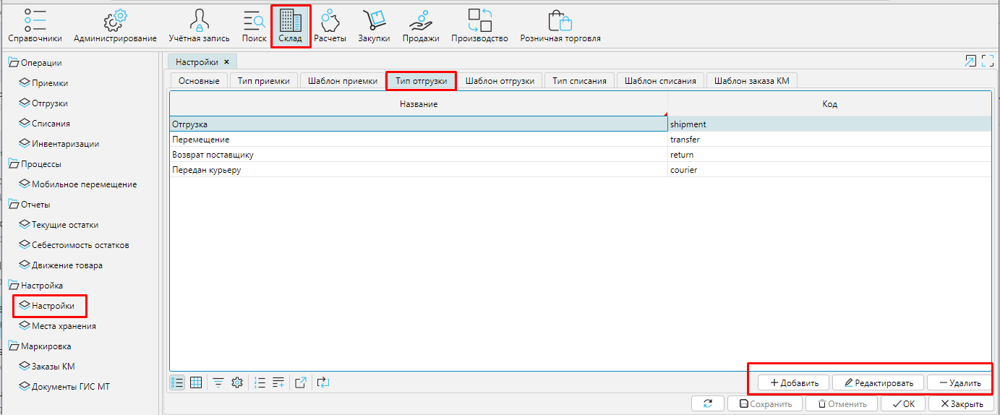
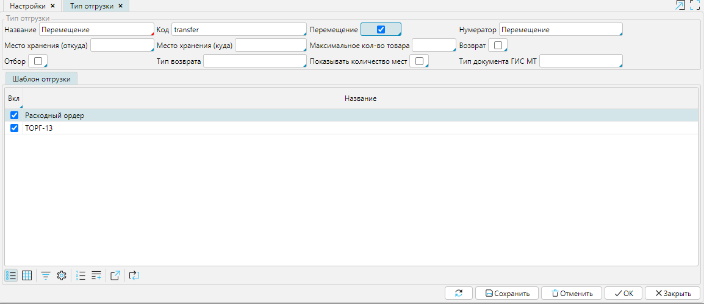

Типы отгрузки позволяют быстро отслеживать перемещение товаров и автоматизировать создание соответствующих документов. Список настроенных типов отгрузки находится в **Склад - Настройки ** вкладка **Типы отгрузки**. Вам необходимо создать и настроить типы отгрузки, которые используются в вашей деятельности.

  
Рис. 1 Список Типов отгрузки

  

Чтобы создать тип отгрузки нажмите кнопку **Добавить** и выберите подходящие настройки.

  
Рис. 2 Настройка типа отгрузки

  

**Название** -  используйте понятное вам и сотрудникам имя для типа отгрузки.

Код - уникальный идентификатор настраиваемого типа документа.

**Трансфер** - включите этот признак (поставьте галочку), если вам необходимо указать перемещение товара внутри своей организации. В документе **Отгрузка** будут поля **Место хранение (откуда)** и **Место хранение (куда)**, но не будет поля **Покупатель**.

### Нумератор** - укажите нумератор, который будет использоваться для создания уникального номера отгрузки. О настройке нумераторов читайте **[здесь](http://documentation.luxsoft.by/pages/viewpage.action?pageId=72942230).

**Место хранения по умолчанию (откуда)** - выберите место хранения из списка, которое автоматически будет указано в поле Место хранение (откуда) в документе Отгрузка этого типа.

**Место хранения по умолчанию (куда)** - это поле будет отображаться, если вы включили ***признак Трансфер***. Выберите место хранения из списка, которое автоматически будет указано в поле Место хранение (куда) в документе Отгрузка этого типа.

**Максимальное количество товара** - в этом поле вы можете установить максимальное количество товара для отгрузки. Если в **Отгрузке** будет указано большее количество, вы не сможете сохранить документ.

**Отбор** -  включите этот признак, если хотите, чтобы в [**Отгрузке**](Shipments.md) отображалось место хранения товаров для удобства комплектации. 

**Тип  возврата** - выберите тип приемки из списка. Документ **Приемка** выбранного типа будет автоматически создан, если вы будете создавать возврат на основе данного типа отгрузки (кнопка **Возврат** в **Отгрузке**).

Показывать количество мест - если этот признак включен, то в документе будут доступны колонки 

Тип документа ГИС МТ - выберите тип документа, который будет формироваться для электронного обмена в ГИС МТ «Честный Знак».

Сохраните созданный тип отгрузки.

  

  
