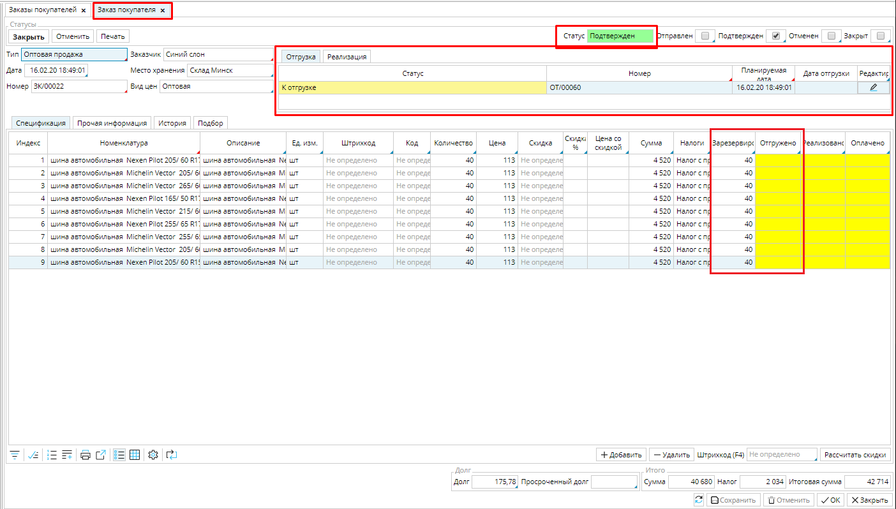
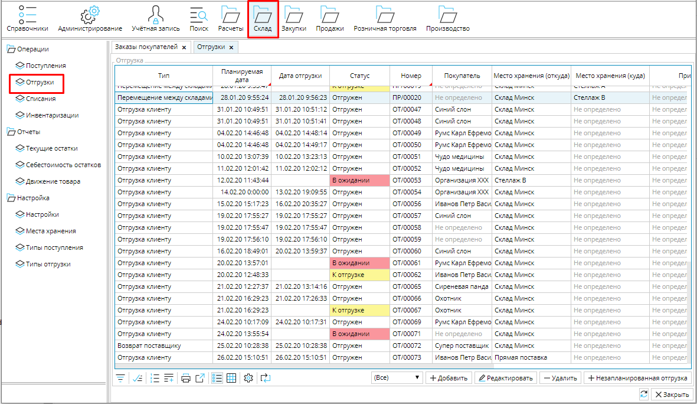
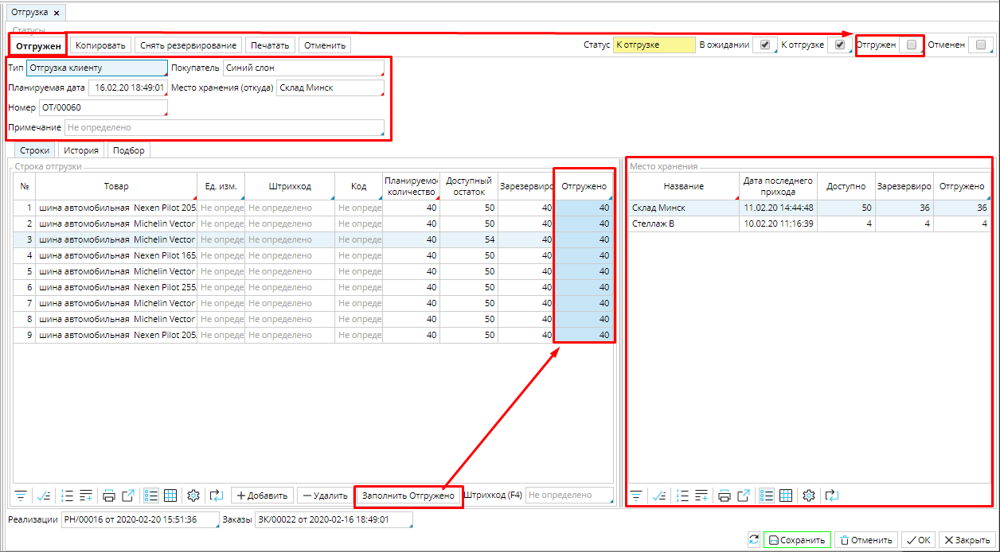
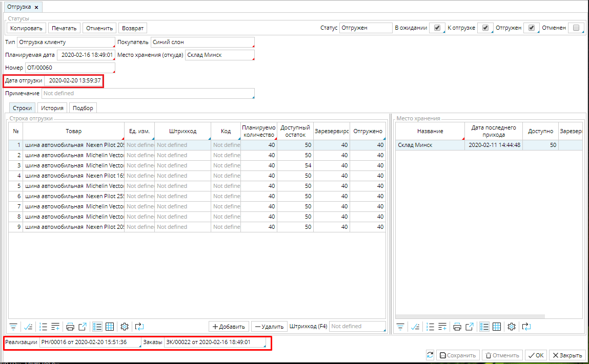

Когда заказ переходит в статус ***Подтвержден***, автоматически создается и отображается в заказе **Отгрузка** в статусе ***К отгрузке*** на количество товара в заказе (см. [настройку типов заказов](Customer_order_types.md)).  Данная отгрузка также будет отображаться в общем списке в **Склад - Отгрузки**. 

### Рис. 1 Подтвержденный заказ на покупку

  

### Рис. 2 Список отгрузок 

  

Чтобы открыть отгрузку, дважды кликните по документу в заказе или в списке отгрузок. 

### Рис. 3  Документ Отгрузки

  

Основные поля документа, такие как **[Тип](Shipment_type.md)** , **Покупатель**, **Место хранения**, **Планируемая дата** будут заполнены в соответствии с заказом и его настройками. **Номер** документа будет задан с помощью [**нумератора**](Numerators.md), который обязательно должен быть настроен, иначе система не позволит перевести заказ в статус ***Подтвержден*** и создать отгрузку. 

В блоке **Место хранения** указано, из какого места расположения отгружается товар для заказа. Если вы при закупке тщательно [размещаете товар](Receipts.md#Размещение-broken), то информация о месте хранения товара существенно облегчит и ускорит комплектацию заказа.  Чтобы блок **Место хранения** отображался, необходимо включить признак ***Отбор*** в [**настройках типа отгрузки**](Shipment_type.md).

В документе необходимо указать отгруженное количество в столбце ***Отгружено***. Если вы отгружаете весь заказ сразу, нажмите кнопку **Заполнить отгружено** и в столбец будет проставлено заказанное количество товаров.  Обратите внимание, чтобы у вас было достаточно товара для отгрузки. В столбце ***Доступный остаток*** указано количество товара на складе за вычетом товаров, зарезервированных для других отгрузок. 

Нажмите **Отгружен**, статус документа изменится на ***Отгружен***, будет указана **Дата** и время отгрузки (см. рис. 3), товар "спишется" со склада, а в [заказе](Customer_orders.md) станет доступна функция **Реализовать**, для создания [документа учета](Customer_invoice_and_Payment_collection.md) и приема платежей.

В **Отгрузке** внизу можно просмотреть связанные с ней заказ и реализацию. При необходимости вы можете их открыть, дважды кликнув по документу.

### Рис. 4 Ссылки на документы, связанные с Отгрузкой

  

  
