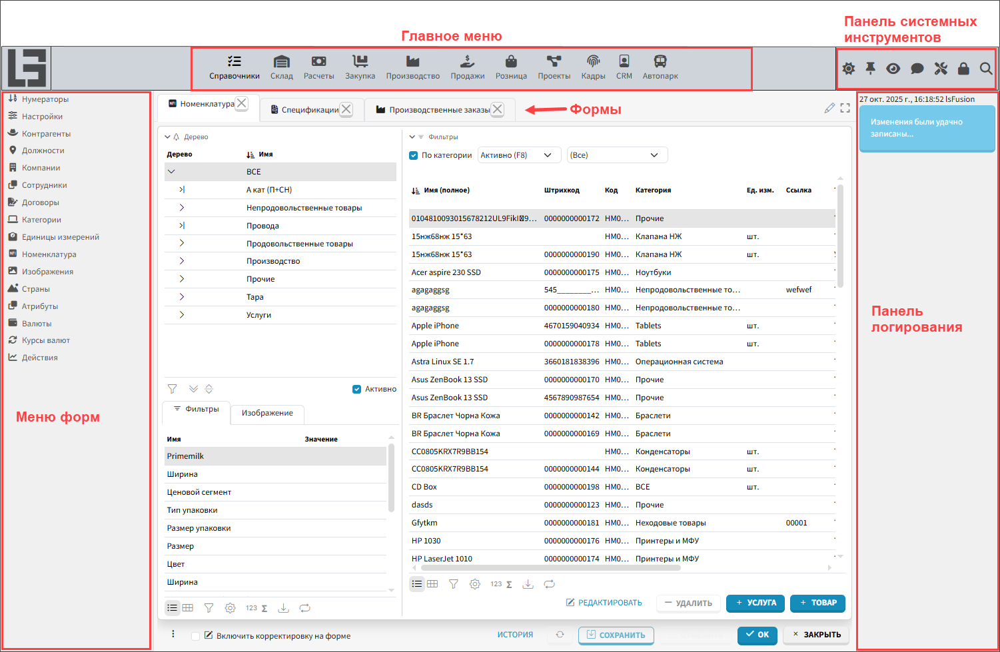
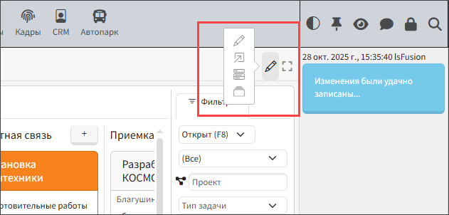
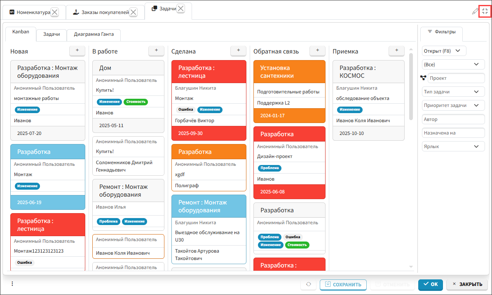
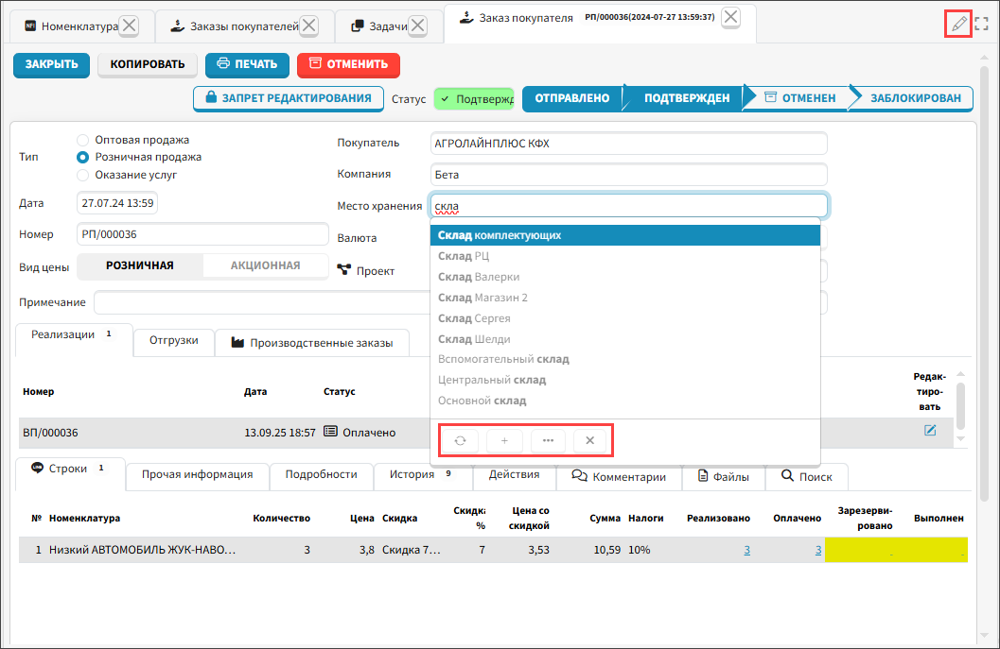
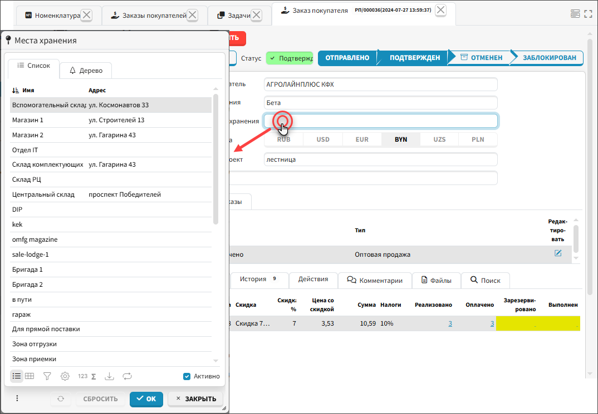
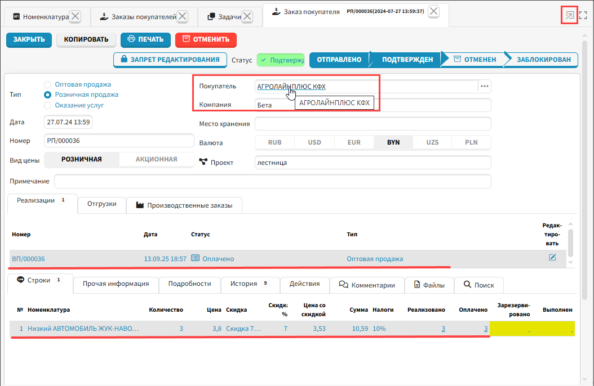

## Рабочий стол
На рисунке 1 изображены основные элементы пользовательского интерфейса MyCompany. На рабочем столе приложения 
расположены навигационные и функциональные панели и рабочая область, где открываются формы, на которых работает 
пользователь. Одновременно может быть открыто несколько форм, которые отображаются как вкладки браузера. Подробно 
формы описаны в статье "**[Формы и режимы отображения данных](Forms_and_modes)**".

**Главное меню** - это навигационная панель, расположенная (по умолчанию) вверху рабочего стола, которая содержит 
меню 
основных 
функциональных модулей. При выборе модуля в главном меню на панели слева отображается список рабочих форм выбранного 
модуля.

**Меню форм** - в навигационной панели справа отображается перечень рабочих форм выбранного в главном меню модуля. 
Чтобы открыть 
форму, по ней нужно кликнуть мышкой, либо выделить курсором и нажать **Enter**. 

**Панель системных инструментов** - это панель, расположенная вверху справа, рядом с главным меню. Эта панель 
предоставляет доступ к инструментам настройки логики и пользовательских предпочтений. Обычно, набор доступных 
инструментов включает следующие:

 Выбор темной/светлой/системной темы соответственно. При выборе системной темы используется тема, настроенная на компьютере пользователя.

 Переключение режимов отображения панелей рабочего стола. Подробно описано в статье 
"Пользовательская настройка 
интерфейса". 

 Выбор дизайна рабочего стола. Подробно описано в статье "Пользовательская настройка интерфейса".

 Открывает внутренний чат приложения.

 Открывает в боковой панели доступ к формам меню **Учетная запись**.

 Открывает форму поиска.

 Открывает в боковой панели доступ к формам меню **Администрирование** для настройки системы.

**Панель логирования** - панель расположена справа, на ней отображаются все действия текущего пользователя.

*Рис. 1 Рабочий стол*

## Режимы работы

В приложении доступны несколько режимов работы:
- Полноэкранный режим
- Режим по умолчанию
- Режим диалога
- Режим перехода по ссылке 
- Режим групповой корректировки

Режим переключается в правом верхнем углу рабочей области. 

  
*Рис. 2 переключение режима работы* 
### Полноэкранный режим
Рабочую область с формами можно развернуть на полный экран, в этом случае не видны панели навигации и логирования. 
Чтобы развернуть формы на весь экран, используют кнопку , чтобы вернуться в обычный режим, 
используют кнопку .

 
*Рис. 3 Рабочая область развернута на весь рабочий стол*
### Режим по умолчанию
Режим по умолчанию обозначается символом . При заполнении полей, включая поля с выбором из 
выпадающего 
списка, программа 
предлагает варианты автозаполнения. Если это поле с выбором из справочника, то программа отображает первые 15 
вариантов. Чтобы просмотреть все возможные варианты выбора, нужно нажать три точки (рис. 4) и отобразится окно 
справочника, из которого можно выбрать значение. Если нажать знак плюс, то откроется окно для создания нового 
объекта в справочнике, из которого осуществляется выбор. Чтобы удалить информацию, внесенную в поле, нужно нажать 
крестик. 

 
*Рис. 4 Режим по умолчанию*

### Режим диалога

Режим диалога обозначается символом . В этом режиме при необходимости выбрать в поле значение из 
справочника, сразу открывается 
диалоговое окно.

 
*Рис. 6 Режим диалога*

### Режим перехода по ссылке
Режим перехода по ссылке обозначается символом . В этом режиме в выделенных курсором строках и 
полях подсвечиваются объекты, на формы которых можно перейти. Переход 
совершается по кликну на объект (рис. 6). В других режимах перейти к объекту можно удерживая клавишу **CTRL** и 
кликнув на 
объект. 

 
*Рис. 6 Режим перехода по ссылке*

### Режим групповой корректировки

