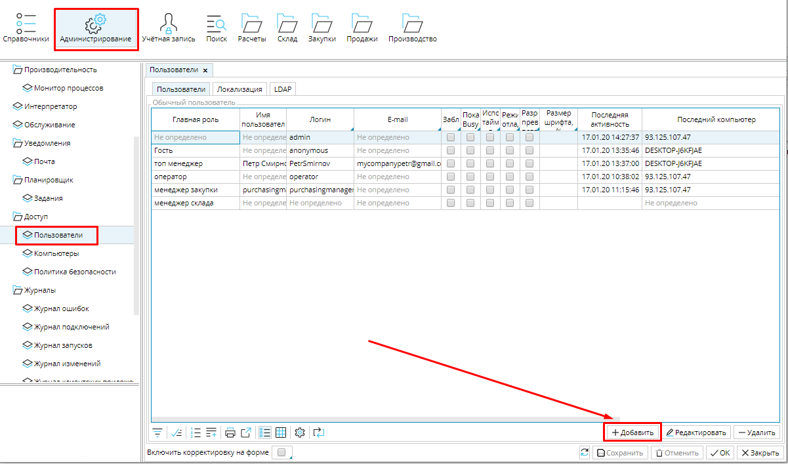
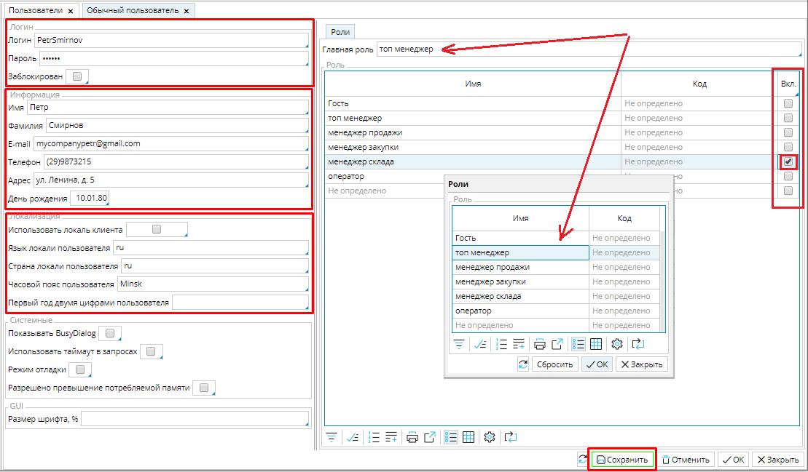

 Рис.1 Добавление пользователя

  

  

 Для каждого [сотрудника](Employees_directory.md), который будет работать в системе, необходимо создать отдельного пользователя.  Для этого в модуле **Администрирование** откройте вкладку **Пользователи**. На рабочем столе нажмите кнопку **Добавить**, откроется форма **Обычный пользователь**. Заполните поля формы.

  

  

  

В блоке **Логин** задайте имя пользователя и пароль для входа в систему. Здесь же можно заблокировать пользователю вход в систему.

В блоке **Информация** можно заполнить личные данные сотрудника.

В блоке **Локализация** настраиваются локальные данные - страна, язык, дата и время. Язык и страна указываются стандартным латинским двухбуквенным кодом. Если включить функцию **Использовать локаль клиента**, то применятся настройки компьютера, на котором сотрудник работает в системе. 

Чтобы установить уровень доступа сотрудника в систему, ему необходимо назначить [Роль](User_roles.md). Для этого надо кликнуть в поле **Главная роль** , выбрать роль в открывшемся окне и нажать **ОК**. Если один сотрудник выполняет функциональные обязанности нескольких, ему можно добавить другие роли.  Для этого в таблице ролей надо пометить функцию **Вкл.** для соответствующей роли. В таком случае сотруднику будут доступны разрешения каждой из отмеченных ролей.

Сохраните пользователя.

Рис. 2 Настройка пользователя

  

  

  

  

  
