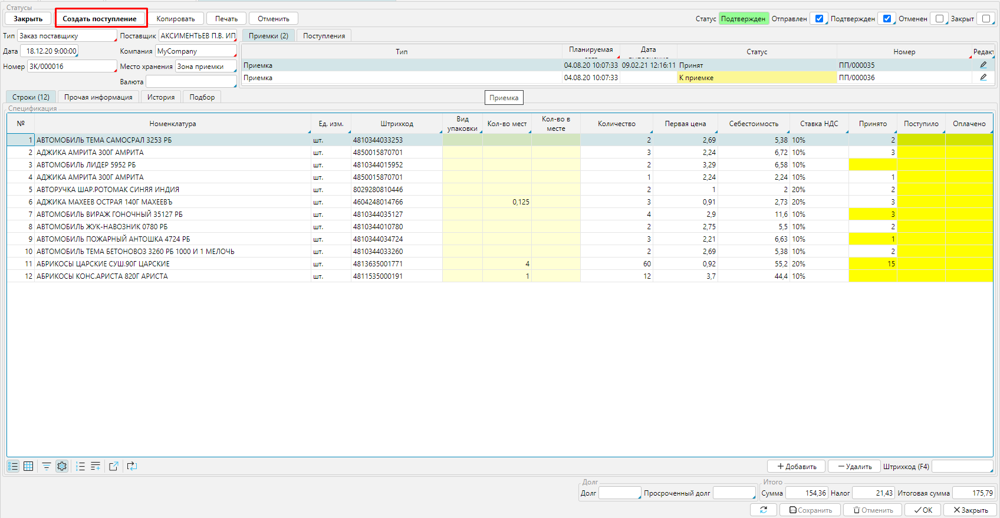
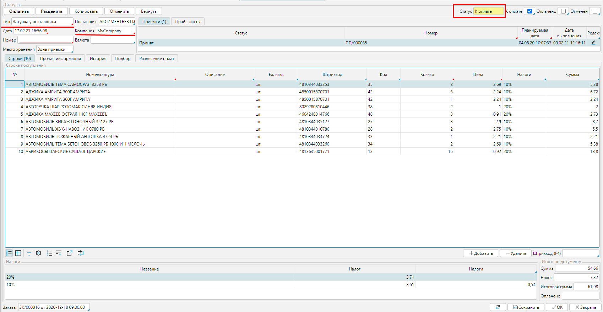
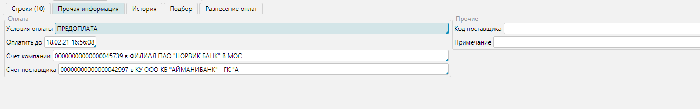
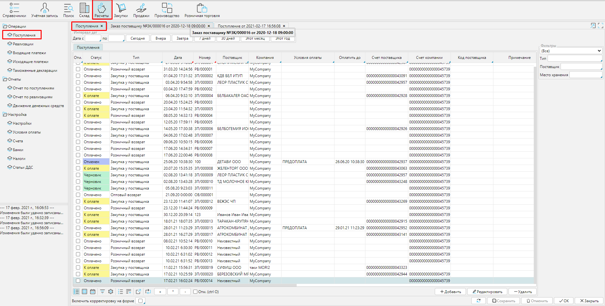
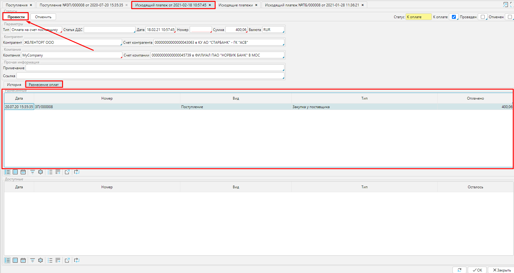
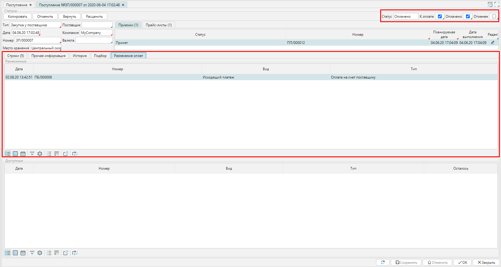
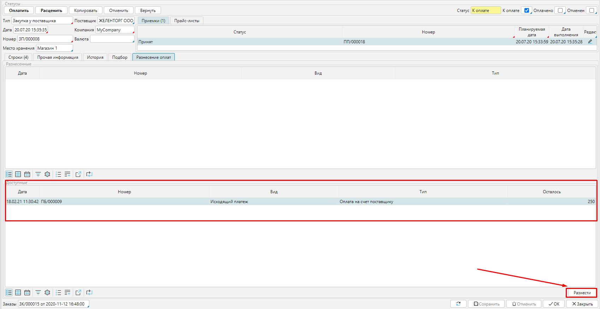
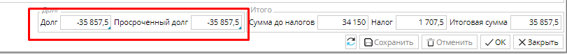

Когда заказанный товар **[принят на склад](Receipts.md)**, в [**Заказе**](Puchase_order.md) становится доступна опция **Создать поступление**. 

  
Рис. 1 Создание Поступления  из заказа

Кликнув на **Создать поступление **вы создадите документ **Поступление**, который является первичным документом учета, т.е. соответствует реальной накладной или инвойсу и необходим для учета стоимости поступившего товара  на балансе вашей компании и оплаты товара.   

Документ будет создан в статусе ***К оплате ***на весь принятый или заказанный товар, в зависимости от настройки [**типа заказа**](Purchase_order_type.md).  Стоимость товара и все остальные данные будут соответствовать заказу.  Вам необходимо указать, какая из ваших [**Компаний**](Partners_directory.md#Company-broken) является получателем товара, если **Компания** в системе одна, поле заполнится автоматически. Также, необходимо будет указать [**Тип** поступления](Bill_type.md), если он не задан в настройках заказа.

  
Рис. 2 Поступление на принятый товар

  

Во вкладке **Прочая информация** будут отображены **Условия оплаты**, соответствующие заказу и дата, до которой необходимо произвести оплату товара. Также будут указаны счета по умолчанию поставщика и вашей компании. При необходимости их можно изменить.  Для этого надо кликнуть в поле счета и выбрать другой счет из  доступных. Как настраивать счета контрагентов смотрите **[здесь](Partners_directory.md)**.

Для удобства можете указать, под каким номером числиться документ у поставщика, в поле **Код Поставщика** и напечатать **Примечание**, которое будет видно в общем списке документов в модуле **Расчеты - Поступления**. 

  
Рис. 3 Вкладка Прочая информация в Поступлении

  

  
Рис. 4 Список Поступлений

  

Оплатить поставку можно нажав в **Поступлении  Оплатить **(см. рис. 2) . Откроется окно нового **Исходящего платежа**,  где будут уже заполнены все поля в соответствии с **Поступлением**. Вам останется указать [**Тип платежа**](Payment_type.md), если он не указан в [**настройках** **Поступления**](Bill_type.md), и  добавить при необходимости примечание или ссылку, чтобы позже  легче ориентироваться в списке платежей. В блоке ***Разнесенные   ***будет отображаться **Приобретение**. Нажмите **Провести** и платеж будет обработан.  

  
Рис. 5 Исходящий платеж

  

В **Приобретении** во вкладке **Разнесение оплат**  платеж отобразится в блоке ***Разнесенные***. А статус изменится на ***Оплачено***.  

  
Рис. 6  Оплаченное Приобретение

  

Если вы работаете по предоплате, и платеж был совершен заранее, то он будет отображен в **Поступлении** во вкладке **Разнесение оплат** в блоке ***Доступные***.  Вам останется лишь нажать **Разнести** и статус измениться на  ***Оплачено***. 

  
### Рис. 7  Отображение предоплаты

  

Если вы не оплачиваете **Поступления** в сроки, соответствующие условиям оплаты, в [**Заказе**](Puchase_order.md) отображается долг перед поставщиком. 

  
Рис. 8  Просроченная оплата

  

  

  
