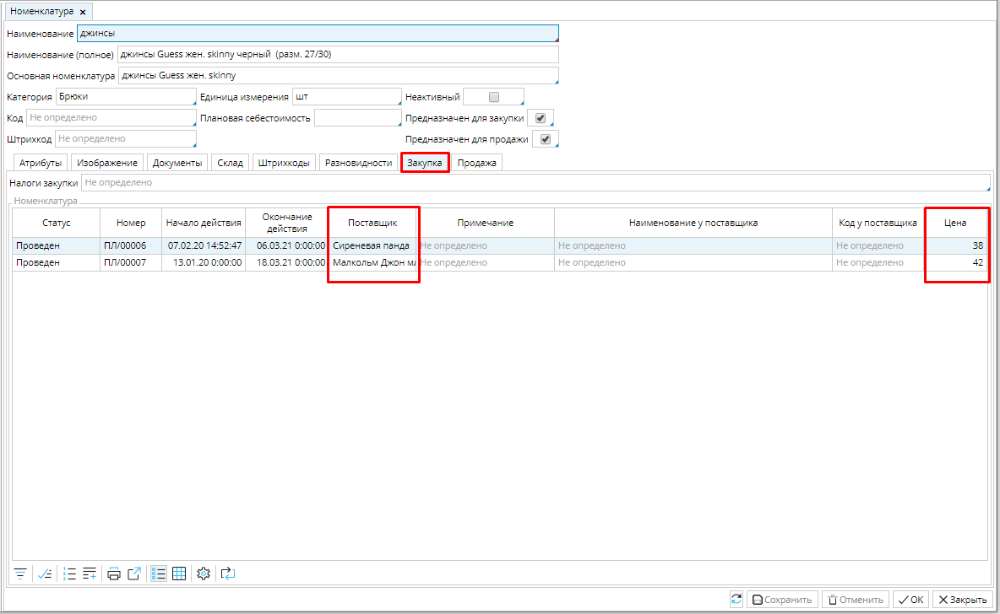
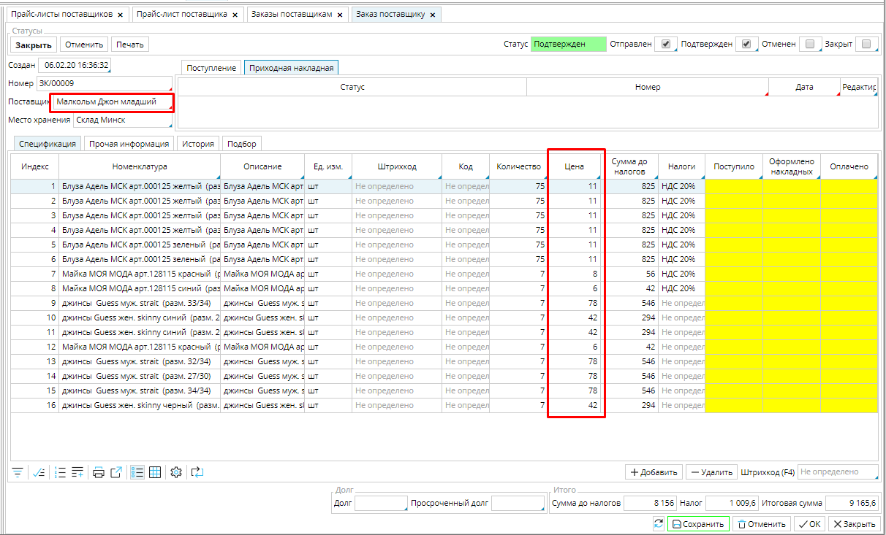
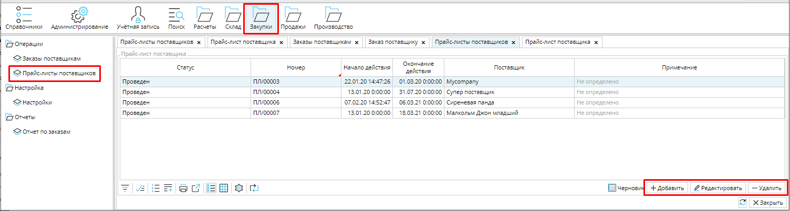
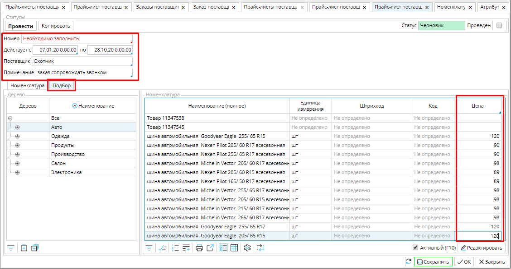
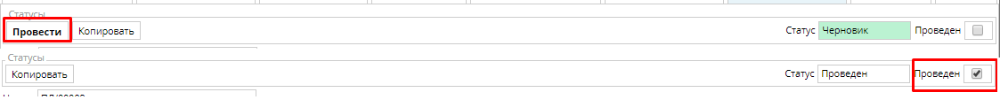

Прайс-листы существенно экономят ваше время при оформлении заказа, а если у вас есть поставщики и товары, с которыми вы работаете длительное время, то этот инструмент становиться незаменим. Вы сможете быстро определить, какой поставщик предлагает товар по более выгодной цене, а при формировании заказа не будете тратить время на введение цен, они будут уже проставлены автоматически.

### Рис. 1 Цены на товар от нескольких поставщиков

### Рис. 2 Цена на товары в заказе

Список прайс-листов всех ваших поставщиков отображается в **Закупки - Прайс-листы поставщиков**. В них легко ориентироваться, т.к. вы сразу видите срок действия, статус и принадлежность прайса. Кроме того, если есть какие-либо особенности работы с конкретным прайс-листом, их можно указать в **Примечаниях**, и они тоже будут видны в общем списке.  

### **Рис. 3 Список прайс-листов поставщиков**

Чтобы ввести в систему новый прайс, нажмите **Добавить** и заполните все необходимые поля:

**Номер** - введите вручную или настройте [**нумератор**](Numerators.md).

**Действует с** \_\_\_\_\_\_ **по** \_\_\_\_\_\_ - установите срок действия прайс-листа. Датой начала действия автоматически устанавливается  дата и время создания прайса. Ее можно изменить при необходимости. Если дата окончания действия прайса не установлена, он будет в силе, пока не начнет действовать новый прайс на перечисленные товары данного поставщика. 

**Поставщик** - кликните в поле и выберите поставщика из списка [**контрагентов**](Partners_directory.md). 

**Примечание** - если есть особенности работы по этому прайс-листу, укажите их в этом поле и они будут видны в общем списке прайс-листов. 

Теперь необходимо ввести список товаров во вкладке **Номенклатура**. Можно использовать кнопку **Добавить** и вводить по одному товару, но в прайс-листах обычно большое количество товаров, поэтому удобнее использовать вкладку **Подбор** и ввести товары списком. Перейдите во вкладку **Подбор**. В правом блоке будут отображены все товары из **Категории**, выбранной в левом блоке.  Все товары, для которых вы укажете Цену, будут автоматически отображены во вкладке Номенклатура. 

### Рис. 4 Заполнение информации в новом прайс-листе

### Рис. 5 Заполнение информации о товарах

  

Колонки **Код** и **Штрихкод** товаров заполняются автоматически, если указаны в [**карточке товара**](Items_directory.md).  Часто бывает, что имя товара у поставщика не совпадает с наименованиями в вашей системе учета товаров.  Поэтому полезно заполнять столбцы **Наименование у поставщика** и/ или **Код у поставщика**. Это позволяет избегать путаницы и недопониманий. 

Новый прайс-лист имеет статус  ***Черновик***. Вы можете сохранить его на любой стадии заполнения и вернуться к нему позже. Для того, чтобы данные из прайс-листа использовались в системе, его надо **Провести**, статус изменится на ***Проведен***.

### Рис. 6 Статусы прайс-листа

  

**Копировать** - нажав на эту кнопку, вы создаете новый прайс-лист, в котором сохранена вся информация из копируемого, кроме номера. Это удобно, когда одни и те же товары вы закупаете у нескольких поставщиков. Таким образом вам не надо несколько раз создавать списки товаров, достаточно изменить **Поставщика** и **Цену**, например.  

  

  
